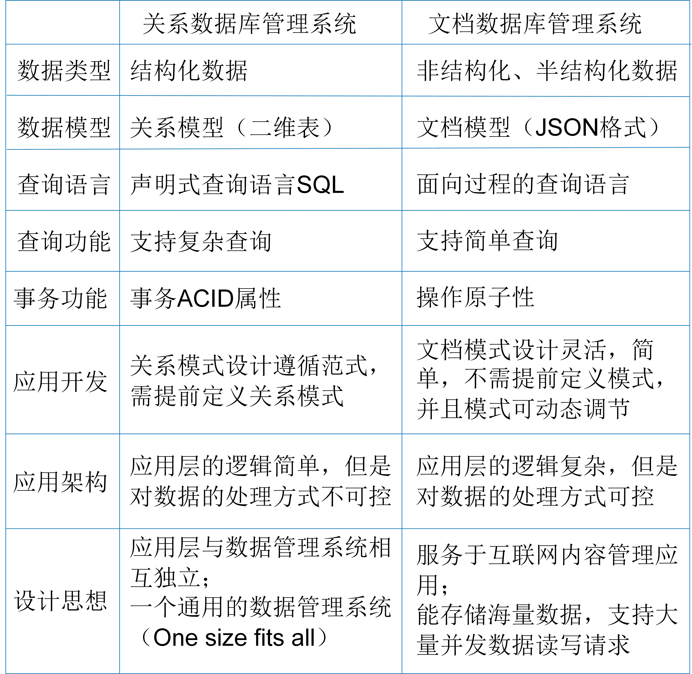

# 不同类数据库的对比

每类数据库管理系统都有自己的优缺点和适用的场景。只有充分了解各类数据库管理系统之间的区别才能在应用开发时作出合理的选择。本小节主要对比本书重点介绍的关系数据库管理系统和文档数据库管理系统。图9.3总结了两类系统在各个方面的差别，本小节将重点介绍它们在应用开发、应用架构、设计思路上的区别。

<center>
	
	<br>
	<div display: inline-block; padding : 2px>
		图 9.3 关系数据管理系统与文档数据管理系统的差别
	</div>
</center>

## 易用性

在应用开发方面，文档数据库管理系统比关系数据库管理系统具有更好的易用性。文档数据库管理系统的易用性表现在两个方面：数据库模式设计更加灵活，更加适配于面向对象的程序设计（Object-Oriented Programming）。

关系数据库使用关系模型描述结构化数据，数据模式需要提前定义且不能随意改变，数据的操作要严格遵循数据模式的定义。文档数据库使用文档模型描述非结构化数据，数据模式不需要提前定义，并且可以动态调节，每个数据实体的属性可以不同。此外，关系模式的设计需要严格地遵循三范式，而文档模式的设计则更加灵活和自由。

例如，描述学生对象信息，包括学生的学号（Sno）、姓名（Sname）、爱好（Hobby）和地址（Address），其中，一个学生的爱好可以有任意个，地址中包含国家、省份和城市。在关系数据库中，学生的信息需要用三张表进行存储。学生表Student中存储学生的学号、姓名和所在城市，爱好Hobby表中存储学生的学号和学生的爱好，地址Address表中存储城市和城市所属的省份及国家。而在文档数据库中，学生的信息可以直接存储在一个Student文档集中，一个学生的信息存储在一个文档中。

```bson
关系模式：
Student(Sno,Sname, City)；
Hobby(Sno,Hobby);
Address(City,Province,County)；

文档模式：
Student
{
	"Sno": "",
	"Sname": "",
	"Hobby":["",""],
	"Address":{
		"County":"",
		"Province":"",
		"City":""
		}
}
```
文档数据库支持存储数组和文档嵌套，一个对象的所有信息通常可以封装在一个文档中，不需要像关系数据库设计时那样考虑一个关系模式中的属性要具备不可拆分性，不能存在部分函数依赖和传递函数依赖。相比之下，文档数据库设计更加灵活，用户使用起来也更加方便。当查询某个对象的所有信息时，文档数据库只需要执行一次简单的文档读取操作，而关系数据库需要执行三张表的连接操作。所以，文档数据库的模式设计还可以避免大量的连接查询。

另外，面向对象的程序设计（Object-Oriented Programming）方法是当今企业级应用开发环境中的主流开发方法。文档数据库采用BSON或者JSON对象存储数据实体，天然地适配于面向对象的编程思想和使用习惯。而关系数据库采用二维表存储数据实体，应用开发时必须借助对象关系映射（Object-Relational Mapping，ORM）工具实现对象到关系数据的映射。ORM工具减少使用SQL访问数据库，实现了关系数据库访问的对象化。所以，在面向对象的开发环境中，文档数据库使用更加简单，程序员更容易上手。

## 可控性

在应用软件架构方面，基于关系数据库管理系统的应用层比基于文档数据库管理系统的应用层更简单，但是基于文档数据库管理系统的应用层对数据处理的可控性更强。

所谓的可控性是指程序员能够采取更加高效的方式实现对数据库的查询和处理功能。关系数据库管理系统支持复杂的查询处理和事务处理功能，允许以声明式结构查询语言SQL访问数据库。应用开发时，程序员只需要调用SQL指令提出“做什么”，而无须指明“怎么做”，数据的存取路径选择以及数据处理操作由数据库管理系统自动完成。这大大简化了应用层的设计和编程复杂性，但也使得数据处理的方式比较固化或者说是通用化。程序员无法根据不同的应用场景、数据分布等特点采取更为高效的数据处理策略。

相反，文档数据库管理系统只支持简单的CRUD操作，最初的版本不支持事务功能，并以面向过程的语言访问数据库。应用开发时，程序员需要指定数据的存取路径，设计复杂查询和事务处理的执行策略。这增加了程序员应用开发的难度，但也增强了对数据处理方式的掌控程度。程序员可以根据应用特征和数据分布设计合适的查询处理策略和事务处理策略，从而使得整个软件系统的执行效率更高。

## 设计思路

关系数据库管理系统诞生于20世纪70年代，它的设计思想包括两个方面：

* （1） 在软件应用系统中，数据库管理系统与应用程序层要相互独立，耦合度越低越好，要尽量减少软件系统开发的难度；
* （2）支持对结构化数据几乎所有的OLTP和OLAP应用，要成为一个通用的数据管理平台，即“One size fits all” （一统天下）。

基于上述两个设计思想，Edgar Frank Codd提出了具有严格数学理论的关系模型、可逻辑推理的关系演算和声明式的查询语言SQL。在当时，基于关系数据库管理系统可以构建各行各业的应用软件系统。应用程序与数据库管理系统之间的独立性也使得企业需要同时拥有应用开发团队（Developer）和数据库运维团队（Database Administrator, DBA）。应用开发团队负责应用软件架构设计和程序开发，数据库运维团队负责数据库管理系统的调优和运维。两个团队各司其职且缺一不可。

文档数据库管理系统诞生于21世纪大数据时代，它的设计思想包括：

* （1） 支持互联网内容管理应用（如微博、短视频等）中的半结构化/非结构化大数据的存储和管理，具有较好的可扩展性；
* （2） 支持大量高并发的大数据读取请求和少量的数据增删改请求，具有较好地读取和写入性能；
* （3） 允许数据具有上千个属性，且数据模式的改变不会影响已有的应用系统程序。

由于大数据应用的多样性和差异性，作为应用支撑的数据管理系统已经无法做到一统天下，即“One size does not fit all”。文档数据库管理系统聚焦于互联网的内容管理应用，采用灵活的文档模型、类JSON的存储形式管理结构化和半结构数据，使用分布式架构和并行处理技术实现系统的可扩展性和高性能。可以说，文档数据库管理系统是应用驱动的产物。它常用于以下应用场景：

* 社交应用：存储用户信息、用户发表的动态信息、点赞、礼物和互动等信息，提供基于地理位置搜索附近的人和信息的查询等功能；
* 游戏应用：存储用户信息、用户的游戏装备和积分等信息，提供快速查询和更新功能；
* 物流应用：存储物流订单信息，提供订单状态更新和查询功能。

文档数据库管理系统使用面向过程的查询语言，这使得软件应用程序与数据库管理系统之间的联系更加紧密，耦合度更高。也就是说，应用软件开发人员不仅要负责应用软件架构设计、程序开发，同时还要负责文档数据库管理系统的调优和运维。这打破了传统软件开发模式中开发团队与运维团队之间的沟通鸿沟，缩短了应用软件的开发周期。传统基于单个关系数据库管理系统的软件开发重视的是程序与数据管理系统之间的隔离，而当前基于微服务架构（Microservice Architecture）的软件开发重视的是服务与服务之间的隔离。所谓的微服务架构是指将整个软件应用拆分成多个子应用，每个子应用称为一个服务，每个服务拥有自己独立的应用程序和数据管理系统，应用程序可以由不同的语言开发并且数据管理系统也可以不相同。微服务架构中每个服务内部是紧密耦合的，也就是应用程序和数据管理系统是紧密耦合的，所以，像文档数据库管理系统这样的NoSQL数据库系统更适合当前微服务架构的软件开发模式。

当然，数据库管理系统的发展进程仍在演进，本小节的对比维度也并不全面。随着技术的不断发展和应用的深入，系统之间的差别也将逐渐明朗。


