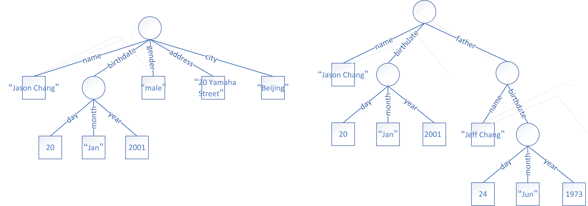

# 文档模型

本书首先进入文档数据库的世界。凡是将文档模型作为数据模型的数据管理系统，我们统称为文档数据库系统。顾名思义，文档模型就是将数据组织成一个个的文档。文档是一个很模糊的概念。文档模型中的“文档”并不是指我们通常看到的文本或文章，而是像下面这样的数据组织方式：

```bson
{
  "name": "Jason Chang",
  "birthdate": "Jan 20, 2001",
  "gender": "male",
  "address": "20 Yamaha Street",
  "city": "Beijing"
}
```
```bson
{
  "name": "Jessie Li",
  "birthdate": "Dec 4, 1992",
  "gender": "female",
  "address": "200 Sichuan Street",
  "city": "Shanghai"
}
```

这里，我们使用文档模型对上一章中的两个实体进行了描述。熟悉Javascript或者Web编程的朋友很快能反应过来：这不就是JSON（JavaScript Object Notation）描述对象的方式吗？没错。JSON使用的数据模型就是文档模型。在文档模型中，一个文档通常用于描述一个实体或对象。在上面的例子中，我们使用了两个文档分别描述Jason Chang和Jessie Li这两个人。文档模型通常的表示方式是将一个文档放置在一对花括号“{”、“}”之中。其内容为多个属性值的集合。比如，Jason Chang的文档包括了姓名（name）、生日（birthdate）、性别（gender）、住址（address）、城市（city）五个属性。其中，name属性上的取值为“Jason Chang”，birthdate属性上的取值为“Jan 20, 2001”，如此类推。

不止如此，文档是可以嵌套的，如下面的例子所示：

```bson
{
  "name": "Jason Chang",
  "birthdate": {
    "day":20,
    "month":"Jan",
    "year":2001
  },
  "gender": "male",
  "address": "20 Yamaha Street",
  "city": "Beijing"
}
```

这里，birthdate这个属性的取值不再是一个字符串，而变成了另一个文档，称为子文档。实际上，子文档里面还可以包含子文档。这样的嵌套可以无限进行下去，如下面的例子所示：

```bson
{
  "name": "Jason Chang",
  "birthdate": {
    "day":20,
    "month":"Jan",
    "year":2001
  },
  "father": {
    "name": "Jeff Chang",
    "birthdate": {
      "day":24,
      "month":"Jun",
      "year":1973
    }
  }
}
```

文档模型实际上是用树形结构去描述数据。每一棵树代表一个文档，树的叶子节点代表属性值，树的中间节点代表子文档。



在上面的例子中，一个属性的取值通常为一个字符串，如“Jason Chang”，或一个数字，如20、2001等。事实上，文档数据库系统中的属性值还可以有多种数据类型，例如浮点型、布尔型、日期、长整型、等等。

```bson
{"x": 3.14}       //浮点
{"x": true}       //布尔
{"x": Date("1988-01-09")}       //日期
{"x": NumberLong("30000000")}   //长整数
```

除了不同的数据类型，属性值还可以是数组的形式。例如，如果Jason Chang有三个email地址，我们就可以将它们放进一个数组里。

```bson
{
  "name": "Jason Chang",
  "address": "20 Yamaha Street",
  "city": "Beijing"
  "email": ["jason.chang@gmail.com", "jchang@163.com", "jasonchang@qq.com"]
}
```

数组里的元素除了是数值，还可以是子文档。

```bson
{
  "name": "Jeff Chang",
  "birthdate": "Jun 24, 973",
  "gender": "male",
  "children": [
    {
      "name": "Jason Chang",
      "birthdate": "Jan 20, 2001",
      "gender": "male",
    },
    {
      "name": "Cindy Chang",
      "birthdate": "Sep 3, 2005",
      "gender": "female",
    }
  ]
}
```

在文档数据库中，为了方便识别每一个文档，通常会使用一个称为“ID”的属性给每一个文档赋一个识别号。这样，我们可以通过ID找到任何一个文档。这个ID属性通常是隐藏的，在需要时可以显示出来。

```bson
{
  "_id": ObjectId("5037ee4a1084eb3ffeef7228"),
  "name": "Jason Chang",
  "birthdate": "Jan 20, 2001",
  "gender": "male",
  "address": "20 Yamaha Street",
  "city": "Beijing"
}
```


