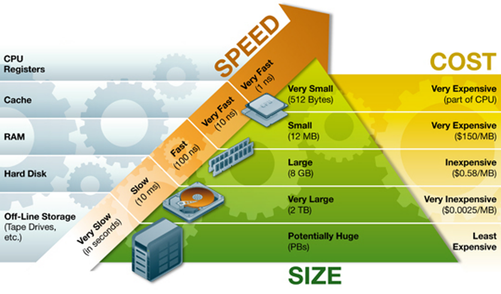

# 文档数据库的存储结构

文档数据库的数据存取功能看似简单，但要高效可靠地实现这些功能并不简单，必须依靠精巧的技术手段。为了能够更好地掌握数据库的使用方法，读者需要了解系统内部数据的物理组织方式。本小节将主要介绍文档是如何被存储在数据库系统中的。

## 存储体系结构

计算机的数据存储体系是一个金字塔结构。下图2.3展示了传统计算机的存储体系结构。最上层是CPU里的寄存器，它是CPU中的计算单元直接获取数据的地方。接下来是缓存（Cache），用于加速CPU对内存的访问。再下面依次为内存（DRAM）、磁盘（Disk）和离线存储（通常为磁带）。这个存储层次结构有一个显著的特点，即越上层的设备存取速度越快，但单位容量的价格越贵。相反地，越下面的设备存取速度越慢，但单位容量的价格越便宜。

<!---->

<center>
	
	<br>
	<div display: inline-block; padding : 2px>
		图 2.3 存储体系结构
	</div>
</center>

以内存和磁盘为例，内存的访问延时为100ns（ns为纳秒），而磁盘的访问延时为10ms（ms为毫秒），二者相差近10万倍。但内存的单位容量价格差不多是磁盘价格的200倍。从性价比方面考虑，通常，企业用户希望使用成本更低的磁盘来存储数据，同时又希望被访问的数据能够存储在内存中来提高访问效率。另外，磁盘是一个具有持久性的设备，也就是说，当计算机断电时磁盘中的数据不会丢失。而内存不具有持久性，只有在计算机运行时内存中的数据才不会丢失。对于任何一个企业或者普通用户来说，数据丢失带来的影响是巨大的，是不可接受的。因此，系统架构师在设计系统时会综合考虑内存和磁盘的优缺点，最终形成一个磁盘-内存的双层数据存储结构。数据可以持久化地存储在廉价的磁盘中，被经常访问的数据从磁盘中读取出来，然后缓存在内存中，用于提高数据的访问效率。


由此可见，图2.3呈现的金字塔型存储体系结构是一种能够兼顾存储成本和访问效率的合理结构。随着硬件科技的发展，新的存储硬件将不断涌现出来，比如最近几年已经相当普及的固态硬盘（Solid State Drive），以及刚问市的非易失内存（Non-Volatile Memory）。但无论存储硬件如何改变，这种金字塔型的存储体系注定不会改变，因为昂贵但速度快的硬件和廉价但速度慢的硬件是很难被彼此取代的，只有配合起来使用才能获得更高的性价比。

系统架构师和开发人员在构建数据库系统时，常常需要考虑到各类存储设备的特性，做到物尽其用。这个理念将体现在本书的很多技术环节中。


## 文档的物理组织

数据库系统的首要责任是妥善保存数据。在数据存储体系结构中，一个应用的所有数据会被存放于最底层的存储设备，通常情况下为磁盘或者固态硬盘（以下统称为硬盘）。离线存储由于访问速度过慢，通常只用于备份数据。只有当硬盘损坏时才会被使用。硬盘之上的内存和缓存存储设备由于价格昂贵，通常只用于暂存被经常访问的数据。被经常访问的数据也称为热数据（hot data）。内存和缓存不具有持久性，当计算机断电时设备中的数据会丢失，这也导致它们不适用于长期存储数据。

对于文档数据库而言，数据是以文档形式进行存储的。那么，文档是如何被存储在硬盘中的呢？文档的大小通常不固定。小的文档可能只有十几个字节（Byte），大的文档可能有数KB甚至达到数MB。用户可以随时访问文档，对它们进行修改，改变它们的大小。硬盘可以看做是一个拥有连续地址的存储空间。文档数据库系统需要将众多文档规整地放置在硬盘中，同时还要做到既不浪费存储空间，又便于管理存储空间。为此，文档数据库系统需要设计一个高效的文档存储结构。

一种最简单的文档组织方式是将文档逐个依次地写入整个硬盘空间。这种看似简单的方式却为硬盘空间的管理带来了麻烦。紧挨着存放的文档可能会随时被修改或者删除。一旦文档大小增加后，原有的空间将无法容纳该文档，系统不得不重新分配一个空间用于存储文档。文档的删除、文档大小的减小和文档位置的移动都会使得原有的存储空间变成空洞，或者说形成硬盘碎片。空洞不仅造成空间浪费，还会降低硬盘的访问速度，影响系统的效能。久而久之，随着文档的频繁删改，这种情况会愈加严重。于是，系统需要对整个硬盘空间进行重新整理，去除空洞。整理过程会耗费大量的时间和资源，这又会导致系统整体性能不稳定。

一种合理的文档组织方式是将硬盘存储空间划分成多个数据块（Block或者Page）,文档存放在数据块中。每个数据块的存储空间可以独立管理。这种方式使得硬盘空间的管理变得简单且高效。当文档被修改或删除时，系统只需要整理该文档所在数据块的存储空间，而不用影响其他数据块。也就是说，系统以数据块为单位来管理整个硬盘存储空间。系统在分配和回收硬盘存储空间时，只需要按数据块进行分配和回收就可以了。

其实，文档的存储与组织可以类比为衣帽鞋袜的存放，磁盘就好比是我们的衣柜。如果直接将所有的衣帽鞋袜堆放在衣柜中，那么衣柜的空间将得不到充分地利用。使用一段时间之后，我们又需要对衣物进行重新规整。整理整个衣柜既费时又费力。一种更为合理的方式是在衣柜中使用收纳箱，衣物分类存放在各个收纳箱中，独立管理。所有收纳箱整齐地存放在衣柜中，这样既整洁又便于使用。


<center>
	
	<br>
	<div display: inline-block; padding : 2px>
		图 2.4 数据块的内部结构
	</div>
</center>

文档数据库系统通常采用第二种组织方式来管理文档，即将硬盘空间划分成多个数据块。数据块是文档存储和硬盘空间管理的最小单元。图2.4刻画了一个数据块的内部空间布局。每个数据块包括三个部分，头部的“页头”（Page Header），中间的文档存储空间以及尾部的指针列表。其中，页头记录了数据块的基本信息，包括数据块中存放了多少文档，还剩多少空闲空间（Free Space）等；指针列表中的指针指向文档在数据块中的存放位置。当用户访问文档时，文档数据库系统首先找到文档所在的数据块，然后将数据块读入内存，之后通过数据块的指针列表找到对应的文档。


还值得一提的是，通常磁盘和固态硬盘被称为“块设备”，也就是说，计算机在访问这些存储设备时，是以物理块为单位来存取数据的。计算机的I/O操作是将一块连续存储空间内的数据整体从磁盘或固态硬盘中读入内存，数据被处理之后，再将一整块数据从内存写回磁盘或固态硬盘。对磁盘而言，一个物理块的大小通常为512B，而对固态硬盘而言，一个物理块的大小通常为4KB左右。块设备的特性也决定了以数据块为单位来管理数据库的存储空间是合适的，这样可以更好地发挥块设备的访问效率。通常，数据块的大小是512B的整数倍，不同数据库的数据块大小也不一样。对文档数据库而言，为了便于文档的存放，一个数据块的大小通常被设置为4MB和32MB之间。


## 文档集的物理组织

在文档数据库中，一个数据库包含多个文档集，一个文档集包含多个文档。通常，同一个文档集中的多个文档被存储组织在同一个数据块中，所以一个文档集拥有一个或者多个数据块。那么，每个文档集到底包含多少个数据块呢？用户又是如何通过文档集的名字实现文档的查询呢？很显然，文档数据库系统需要管理和组织文档集，记录文档集的相关信息，如文档集中文档的数据块位置。

在文档数据库MongoDB 5.0中，每创建一个文档集就会生成一个对应的文件，以collection-xxx.wt命名，用于存储文档集的所有文档。文档集的组织方式类似于文件系统中文件的组织方式。在文件系统中，每个文件对应一个Inode结构。Inode中包含了文件的基本信息和指向数据块的指针，这些信息也称为文件的元数据。图2.5展示了Inode的简单结构，其中，基本信息包括Inode编号、文件类型、文件权限、文件大小、文件修改和访问的时间等。Inode编号具有唯一性，操作系统可以通过编号来识别不同的文件。Inode中的地址指针指向存储文件内容的数据块。一个Inode的大小通常是128B或者256B，它能容纳的指针数量有限。然而，一个文件可能拥有很多个数据块。因此，Inode不仅包含直接指针还包含间接指针。间接指针指向一个指针数据块，该数据块中存放的是地址指针，它可以指向存储文件内容的数据块也可以指向另一个指针数据块。多个指针数据块的这种扩展方式保证了Inode可以记录成千上万的数据块，一个文件可以存储高达TB级别的数据内容。此外，文件系统还提供了一个记录文件名与Inode编号映射关系的数据结构，称为目录项。用户通过文件名读取文件内容时，系统首先访问目录项，找到文件名对应的Inode编号，然后通过Inode编号查询到文件对应的Inode结构，最后根据Inode中的指针读取文件所有的数据块。

<center>
	
	<br>
	<div display: inline-block; padding : 2px>
		图 2.5 Inode数据结构
	</div>
</center>

同样地，文档数据库为每个文档集维护了一个Inode结构，存储文档集的基本信息，如文档集的文件编号、包含的文档数量等，和地址指针。文档集名称与文档集文件编号的映射关系存储在文档集的目录项中，如图2.6所示。在MongoDB 5.0中，文档集的目录项存储在文件\_mdb_catalog.wt中。系统启动时，会首先从硬盘中将文档集的目录项读入内存，通过目录项能够确定某数据库中某一文档集所对应的Inode，然后通过Inode定位文档集的所有数据块并访问文档内容。

<center>
	
	<br>
	<div display: inline-block; padding : 2px>
		图 2.6 文档集目录项结构
	</div>
</center>

基于文档集和文档的组织方式，文档数据库的CRUD操作就能很方便地实现了。比如用户用以下命令来读取person文档集中满足查询条件的文档。

```bson
db.person.find( {
  "gender": "female",
  "city": "Shanghai"
} )
```
对于文档查询操作，系统首先从文档集的目录项中找到当前数据库的person文档集所对应的Inode结构，其次根据Inode中的指针找到person文档集的所有数据块，然后依次将所有数据块读入内存，将数据块中的文档与查询条件进行对比，最终找到符合条件的文档。文档的更新和删除操作首先需要查询到满足更新条件和删除条件的文档，然后在内存中对文档进行修改，最后再将文档所在的数据块写回硬盘。文档的插入操作首先需要找到文档集的Inode结构，然后根据Inode内容找到文档集的最后一个数据块。如果该数据块有足够的空间则将文档写入其中，否则将文档写入一个新开辟的数据块中并更新Inode的信息。

从上述描述中，我们能够发现Inode的组织方式对文档插入操作比较友好，但对文档的查询、更新和删除并不友好。对某个文档的查询操作需要扫描整个文档集，将文档集的所有数据块从硬盘读入内存。大量的硬盘访问会极大地增加查询操作的响应时间。在如今的大数据时代，容量高达TB、PB的文档集比比皆是。从大容量文档集中查询文档可能会消耗分钟级别的时间，这将无法满足当前应用的毫秒级或者秒级的响应时间需求。为此，文档数据库系统需要提供一种更高效的数据组织结构来加快文档的查询效率。我们将在下一小节介绍这种新的数据结构。

在基于硬盘-内存的双层存储体系架构中，系统实现文档读取时先将文档所在的数据块从硬盘读入内存，然后CPU直接访问内存中的文档内容。但是，内存的容量是有限的，它无法同时容纳所有文档的数据块。在对文档的读取操作结束之后，数据库系统会移除一些数据块，也会保留一些数据块。内存中数据块的去留问题由数据库系统的缓存管理器解决。通常，缓存管理器会保留被频繁访问的数据块，这样可以提升数据的访问性能。缓存管理器的策略对数据库系统的性能至关重要。


[**上一页<<**](chapter2.3.md) | [**>>下一页**](chapter2.5.md)

## 习题

1. 假设给你一个由磁盘和内存组成的存储体系和一笔钱，你可以用这笔钱去购买更多的内存或者磁盘去扩展这个存储体系的容量。如果一份数据每10秒钟就会被访问一次，你会选择把它放在内存里还是磁盘里？如果它每隔1个小时才被访问一次呢？如果每隔2分钟被访问一次呢？为什么？

2. 请解释：为什么存储体系会呈金字塔结构（顶层的容量比底层的容量大）？什么情形下我们才不再需要这样的金字塔结构？
