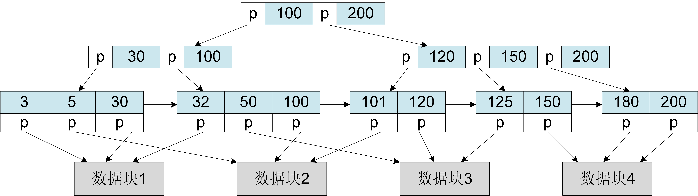
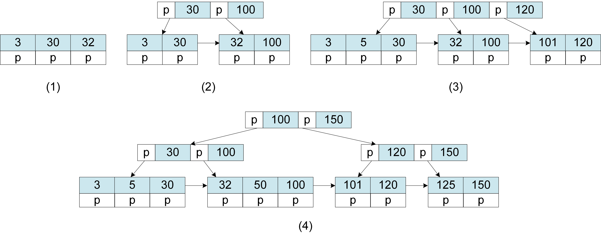
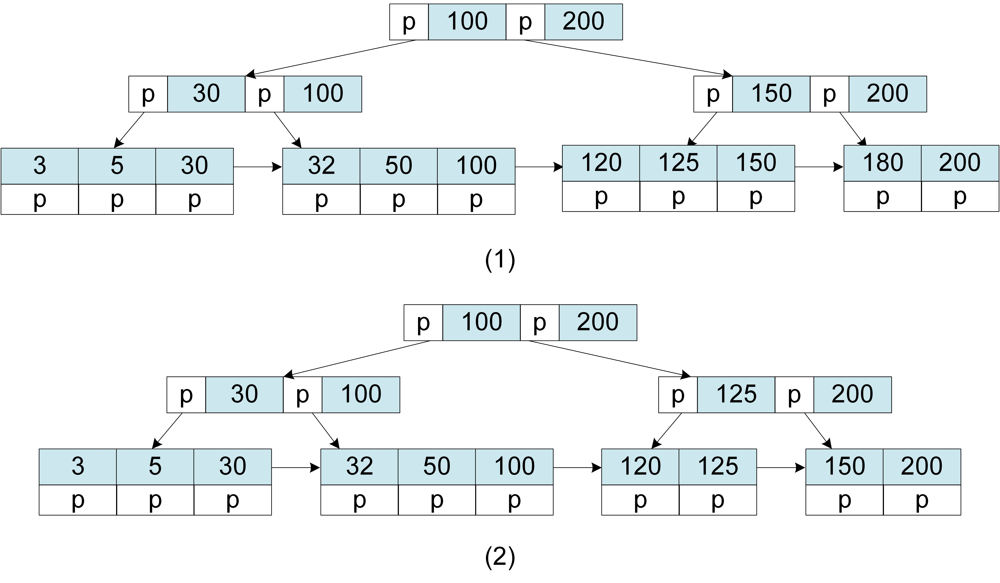

# 文档数据库的索引
数据库系统的数据组织方式决定着数据库存取操作的性能。文档数据库中的文档被组织在一个个数据块中并存储于硬盘，所有的文档数据块通过Inode结构被组织起来形成一个个文档集。当处理用户读取数据请求时，系统需要扫描文档集中的所有数据块，然后筛选出符合查询条件的文档。这种扫描整个文档集的查询效率是非常低的，尤其是在处理大数据集时，查询时间可能高达几分钟。为了提升文档的查询效率，数据库系统通常采用索引结构来重新组织数据。

索引是对文档的某一属性值或多个属性值进行排序的存储结构，它能够在文档集中快速地搜索某个或多个文档属性值并根据文档属性值直接定位到文档所在的数据块。有了索引结构，系统在查询文档时就避免了整个文档集的全部扫描。更通俗一点地讲，我们可以把索引理解成一种函数，输入是查询条件（文档属性值），输出是查询结果所在的数据块地址。索引实现的是从文档属性值到文档所在数据块地址的映射。常用的索引数据结构有B树、B+树、Hash表和跳表（SkipList）。本小节主要介绍MongoDB的B+树索引结构以及索引的创建与使用。


## B+树索引结构 
B+树是B树的一种优化，它们都属于一种平衡的多路查找树。相比于传统的二叉树，B树和B+树的结构更平衡、更稳定、更矮胖，它们能够有效地减少查询过程中的硬盘读取次数，提高查询效率。

<center>
	
	<br>
	<div display: inline-block; padding : 2px>
		图 2.7 B+树结构
	</div>
</center>

B+树的结构如图2.7所示。它是由根节点、中间节点和叶子节点组成的树型结构，其中最底层对所有键值（key）进行排序的节点称为叶子节点，最上层的单个节点称为根节点，其余称为中间节点。在文档数据库中，文档的任意属性值都可以作为键值，最常用的则是文档的ID属性值。根节点和中间节点又称为非叶子节点或索引节点，它们主要用于检索叶子节点。索引节点内部包含键值和指向下一层节点（孩子节点）的指针，叶子节点内部包含键值、键值所对应文档的数据块地址和指向下一个叶子节点的指针。B+树的多路特性决定索引节点可以同时包含多个键值和多个孩子节点。一个m路（阶）的B+树是指索引节点中最多可以拥有m个孩子节点。一个m阶的B+树具有如下的特征：

*  从根节点到叶子节点的所有路径都具有相同的高度；
*  节点中的键值同时存在于其孩子节点中，对应孩子节点的最大值或者最小值；
*  只有叶子节点包含所有键值和键值指向的数据块地址；
*  叶子节点的键值从左到右升序排列，叶子节点之间通过指针连接；
*  根节点至少拥有2个孩子节点；
*  除根节点之外的节点至少拥有m/2个孩子节点；

B+树对每个节点的键值个数也有一定限制。但是当前并没有形成对B+树的统一定义，不同的定义，其规则也不相同。百度百科对B+树的定义是非叶子节点的键值个数等于节点的孩子个数，所以除根节点之外，节点的键值个数范围在m/2和m之间；维基百科对B+树的定义是非叶子节点的键值个数比节点的孩子个数少一个，所以除根节点之外，节点的键值个数范围在m/2-1和m之间。目前，文档数据库MongoDB和关系数据库MySQL的B+树索引结构遵循的是百度百科的定义。 


B+树的结构与B树相似，不同之处在于（1）B树的索引节点内部还包含了键值所对应的数据块地址；（2）节点中的键值不存在其孩子节点中；（3）叶子节点之间没有指针链接。在数据库系统中，B树和B+树的每个节点被看作一个数据块并存储于硬盘。显而易见，相比于B树，B+树的每个节点能够存储更多的键值。对于相同数据量的键值而言，B+树的结构会更加矮胖一些，查询过程中的硬盘IO次数也会更少一些。在B+树中，只有叶子节点含有指向数据块的指针，因此每次查询都需要检索到叶子节点。相比于B树，B+树的查询性能会更加稳定。此外，B+树的叶子节点形成了有序链表，因此更便于范围查询。

```bson
db.student.find( 
  {"sno": "101"} 
)
```

接下来，我们来看看数据库系统MongoDB是如何利用B+树来实现文档查询的。比如，用户想从学生（student）文档集中读取学号（sno）为“101”的学生的信息。数据库系统以sno作为键值构建了如图2.7所示的一棵高度为3的3阶B+树。执行查询请求时，系统首先将B+树的根节点从硬盘读入内存，并将“101”与根节点中的两个键值进行比较。由于“101”大于键值“100”小于键值“200”，说明查询的结果位于根节点的右侧。之后，通过根节点的指针将右侧的中间节点从硬盘读入内存，再将中间节点的键值与“101”进行比较，找到“101”所在的叶子节点并将该叶子节点从硬盘读入内存。最后，通过叶子节点找到“101”所对应的文档数据块地址并读取该数据块。整个查询过程只涉及到4次硬盘IO操作。相比于需要读取文档集所有数据块的Inode组织结构，索引组织结构极大地提升了查询的性能。

此外，B+树也支持范围查询。当用户执行以下命令查询学号大于“101”的学生的信息时，系统首先从B+树的根节点进行遍历找到“101”所在的叶子节点，然后通过叶子节点之间的指针找到键值大于“101”的所有叶子节点，最后通过叶子节点中的数据块地址定位查询结果的数据块。

```bson
db.student.find( 
  { "sno": { $gt: 101} } 
)
```

## B+树插入与删除

B+树能够支持高效的数据查询，那B+树是如何进行初始构建的呢？当数据库系统执行插入和删除操作时，B+树的结构又是如何进行更新的呢？

```bson
db.student.insertMany( [
  {"sno":"3", "name":"Steven"},{"sno":"30", "name":"John"},{"sno":"32", "name":"Aimee"},
  {"sno":"100", "name":"Anna"}, {"sno":"5", "name":"Rose"},{"sno":"101", "name":"Lily"},
  {"sno":"120", "name":"Ben"}, {"sno":"50", "name":"Bert"},{"sno":"125", "name":"Bob"},
  {"sno":"150", "name":"Daniel"}, {"sno":"180", "name":"David"},{"sno":"200", "name":"Jack"}
] )
```

<center>
	
	<br>
	<div display: inline-block; padding : 2px>
		图 2.8 B+树插入
	</div>
</center>

假如我们插入如上的的12个文档，并以学生的学号（sno）作为键值构建一个3阶的B+树索引。B+树遵循百度百科的定义，即所有节点的键值个数最小为2，最大为3；非叶子节点的孩子节点个数最小为2，最大为3。B+树采用的是自底向上的构建方法，它的构建过程如图2.8所示。

* 第一步：首先初始化一个叶子节点并将“sno=3”和该文档对应的数据块地址（此处用p来表示）插入其中，然后依次插入“sno=30”和“sno=32”；
* 第二步：当再插入“sno=100”时，叶子节点的键值个数超过最大值3。此时，首先新增一个叶子节点，其次重新调整各叶子节点中的键值使得"3"和"30"在左叶子节点，"32"和"100"在右叶子节点，之后将两个叶子节点用指针连接起来，然后新增一个索引节点（根节点），将叶子节点中的最大值30和100插入索引节点中并添加指向叶子节点的指针；
* 第三步：依次插入“sno=5”、“sno=101”和"sno=120"时，首先通过B+树查询插入键值所属的叶子节点，然后插入到正确的位置。由于"5"大于键值"3"小于键值"30"，所以"sno=5"属于左叶子节点并被插入"3"和"30"之间。同理，"sno=101"和"sno=120"属于右叶子节点并被插入"100"的右侧。当插入"sno=120"时，右叶子节点键值个数为4，此时按照第二步的步骤增加一个叶子节点，重新调整叶子节点的键值，然后在根节点中增加键值"120"作为索引键值；
*  第四步：当插入"sno=50"、“sno=125”和"sno=150"时，采用查询并删除的方式将"50"插入"32"和"100"之间，"125"和"150"插入"120"右侧。当插入"sno=150"时，首先需要新增一个叶子节点，重新调整叶子节点的键值，然后在根节点中增加键值"150"。此时，根节点中的键值个数为4，需要将其拆分成两个中间索引节点，"30"和"100"作为左索引节点的索引键值，"120"和"150"作为右索引节点的索引键值，然后再新增一个根节点，将两个中间索引节点中的最大值"100"和"150"插入根节点中作为索引键值；
*  第五步：最后按查询方式插入"sno=180"和"sno=200"，最终生成如图2.7所示的B+树。

```bson
db.student.deleteMany( 
  {"sno":"101", "name":"Lily"},{"sno":"180", "name":"David"}
 )
```

当数据库系统执行数据删除操作时，B+树的结构也会发生改变。假如我们执行上述的删除文档命令，B+树的更新过程如图2.9所示，描述如下: 
5<center>
	
	<br>
	<div display: inline-block; padding : 2px>
		图 2.8 B+树删除
	</div>
</center>


* 第一步 : 删除"sno=101"，首先通过B+树查询"101"所在的叶子节点，然后从该叶子节点中删除"101"键值和文档对应的数据块地址(p)。由于删除"101"之后该叶子节点只包含1个键值，不满足B+树的定义，因此需要将该叶子节点与其他叶子节点进行合并。当与右侧叶子节点合并之后，更新中间索引节点的索引键值为"150"和"200"；
* 第二步: 删除"sno=180", 首先找到"180"所在的叶子节点并从中删除键值"180"和数据块地址(p)，然后将该叶子节点与左侧叶子节点进行合并。合并后的节点键值个数为4（超过最大值3），则需将该节点拆分成两个叶子节点，其中，"120"和"125"是一个叶子节点的键值，"150"和"200"是另一个叶子节点的键值，最后更新上一层中间索引节点的索引键值为"125"和"200"。


## 索引创建与使用

数据库系统对外提供了指令允许用户创建索引。文档数据库系统MongoDB的索引创建指令为createIndex，该指令包含两个参数，第一个参数指定要创建的属性字段和索引键值的排序类型，第二个参数为可选参数。

```bson
db.student.createIndex({"sno":1})
db.student.createIndex({"name":1, "age":-1})
```

createIndex可以在一个属性或者多个属性上创建索引。前者称为单键索引，后者称为复合索引。上述两个例子中，例1表示在student文档集中的文档"sno"属性上创建索引，"sno"属性值（索引键值）按升序排列；例2表示在文档的"name"和"age"两个属性上创建索引，"name"和"age"共同作为索引键值，索引键值首先按"name"升序排列，然后在每个"name"内按"age"降序排列。

在用户显示执行createIndex指令之后，文档数据库系统以索引属性为键值构建B+树索引结构。当用户执行以下命令，即用索引属性查询文档时，MongoDB可以通过对应索引的B+树快速地定位查询文档所在的数据块地址并读取文档内容。值得额外注意的是，如果想要使用复合索引实现文档的快速查询，那么查询指令中的查询条件需要满足索引的最左前缀原则，即查询条件中必须包含索引的第一个属性。也就是说，想要使用基于"name"和"age"构建的复合索引，查询条件中必须包含"name"属性。

```bson
db.student.find({"sno":"120"})
db.student.find({"name":"Ben", "age":"21"})
```
除了显示创建索引之外，MongoDB默认会为每个文档集创建一个索引。当用户新建文档集，插入文档时，MongoDB自动地在文档的"ID"属性上创建索引。以"ID"属性作为键值构建的B+树结构替代Inode结构，实现文档和文档集的组织与管理。在前面的章节里，我们提到过文档数据库用"ID"属性来唯一标识一个文档。"ID"称为文档的主键，基于主键构建的索引称为主键索引。在主键索引结构中，叶子节点的键值唯一地指向一个数据块地址。基于非主键构建的索引称为辅助索引或者二级索引，该索引结构中叶子节点的键值可能指向多个数据块地址。通常，数据库系统，如关系型数据库系统MySQL，都会默认在数据的主键上创建索引，因此，通过主键来查询数据的效率都很高。除了提到的单键索引、复合索引、主键索引和二级索引，MongoDB还支持唯一索引、文本索引、地理空间索引、聚簇索引和非聚簇索引等。这里就不做更多详细地讲解。


索引可以提高数据查询的效率，那么，索引是不是越多越好呢? 是否需要在每一个属性上都创建索引呢？答案当然是否定的。其原因有以下两点:

* 耗费存储空间。每创建一个索引需要占用存储空间来存储B+树结构，B+树的每一个节点对应存储空间中的一个数据块。有时一个索引所用的存储空间与一个文档集中所有文档所用的存储空间几乎相同。索引越多，耗费的存储空间也就越大。
* 增加数据更新操作的代价。当对文档数据进行增删改操作时，索引结构也要做相应地改变。比如，删除某个文档时，需要同时将该文档在索引结构中的索引键值进行删除。否则，之后通过索引进行查询时就会出错。如果文档集拥有很多索引，那么就会增加对文档集的更新代价，从而导致系统性能降低。

因此，在开发应用软件过程中是否需要创建索引由开发人员进行抉择，他们通常在查询效率、存储空间和更新代价之间进行取舍。

那么，我们到底应该在哪些属性上创建索引呢？总的来说，适合创建索引的属性需要具备以下特点:

* 常用，即经常被用作查询条件的属性。比如，我们经常用人的姓名来查询文档，那么就有必要在名字上创建索引，这样就能够通过索引提高查询效率。
* 稳定，即不会经常被修改的属性。一旦属性被修改，那么基于该属性创建的索引结构也会被修改。B+树节点的修改通常需要先删除节点，然后再插入新节点，因此一次索引更新的代价是巨大的。我们知道个人的银行账户号是不变的，因此可以在账户号上创建索引，而账户余额是经常变化的属性，因此不适合用于创建索引。
* 区分度高，即文档集中拥有相同属性值的文档数量很少。比如，文档"ID"属性，它的区分度就很高，通过某一ID值能够唯一地确定某一文档；再比如人的姓名，其区分度相对较高。在学校、班级、公司等范围内，重名的人相对比较少。因此，"ID"属性和姓名都适合用于创建索引。在它们的索引结构中，叶子节点的键值要么指向一个数据块要么只指向几个数据块。但是，人的性别只有男和女两种取值，其区分度很低，不适合用于创建索引。

本章主要介绍了文档数据库的数据模型（文档模型）、CRUD基本操作、文档和文档集的物理组织方式以及索引结构，并结合MongoDB的实际例子进行讲解，以期读者能够了解、掌握数据库系统的基本概念、操作和存储结构。


