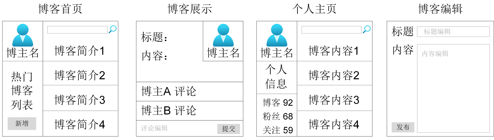
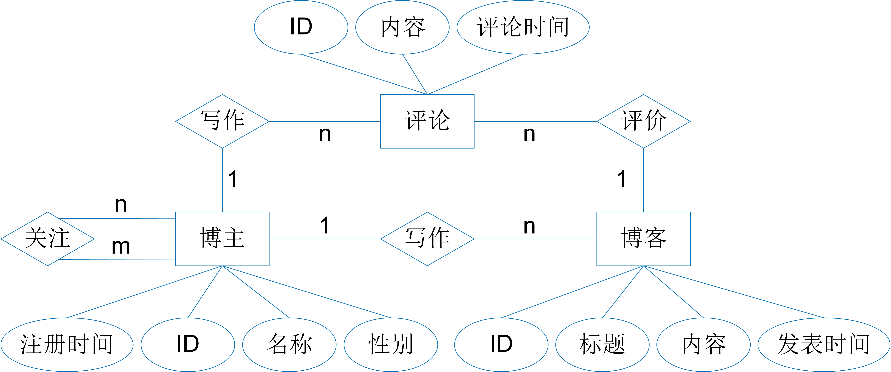

# 文档数据库设计实例

 本小节将通过构建博客网站应用软件来详细地讲解文档数据库设计过程和一些基本的结构设计原则。


## 需求分析

在进行数据库结构设计之前，需要充分了解和分析用户的需求，明确应用的业务流程、数据对象、数据处理的功能和性能要求。需求分析是数据库设计的起点，也是基础，它的结果将直接影响后续的数据库设计步骤，决定数据库设计结果是否合理和实用。

<center>
	
	<br>
	<div display: inline-block; padding : 2px>
		图 3.1 博客网站业务流程
	</div>
</center>

以博客网站为例，此处我们仅对博客网站的核心业务进行需求调研和分析，并得到如图3.1所示的业务流程。在博客网站应用中，用户通过注册成为网站博主，博主和博主之间可以相互关注，形成博主与粉丝的关系。博主登录网站后可以浏览所有已关注博主最新发布的博客简介，阅读他们发表的博客和博客评论，并进行点评，还可以编辑、发布博客，查看粉丝和已关注者的个人主页。

通过对博客网站的业务流程分析，可以梳理出几个关键的前端功能界面。如图3.2所示，包括博客首页，个人主页，博客展示界面和博客编辑界面。

* 博客首页：展示博主的已关注者最新发表的博客简介信息；
* 个人主页：展示博主的个人信息，已发表博客数量，粉丝数量，已关注者数量以及博主发表的博客简介；
* 博客展示界面：展示博主某篇博客的详细内容和评论信息，并可以进行评论编辑；
* 博客编辑界面：编辑博客的标题，具体内容并进行发布。

<center>
	
	<br>
	<div display: inline-block; padding : 2px>
		图 3.2 博客网站前端功能界面
	</div>
</center>

博主登录博客网站后，首先进入博客首页，通过点击首页的新增按钮可以跳转到博客编辑界面，然后编辑并发表博客；点击首页中已关注者的博客简介信息（博客标题）可以跳转到博客展示界面，然后阅读博客的详细内容并发表评论；点击首页和博客展示界面中的博主名可以跳转到对应博主的个人主页，查看博主的个人信息和发布的博客；点击个人主页中的博客内容也可以跳转到博客展示界面。

## 概念结构设计

将需求分析得到的用户需求抽象为概念模型的过程称为概念结构设计，它是数据库设计的关键。概念模型既要真实、充分地反映用户所表达的现实世界，又要易于理解，便于向各种数据模型进行转换。概念模型的表示方法有很多，其中最为常用的是P.P.S.Chen于1976年提出的E-R模型。该模型用E-R图来描述现实世界的概念模型。

E-R图又称实体-联系图(Entity Relationship Diagram)，它提供了表示实体、属性和联系的方法。实体、属性和实体之间的联系概念如下：

* 实体是指现实世界中客观存在并可以相互区别的事物。在应用软件中，实体可以理解为数据对象，例如，一名学生、一门课、一名教师、一名职工等。
* 属性是指实体所具有的某一特性，通常一个实体由若干个属性来描述，能够唯一确定某一实体的属性称为唯一性属性。例如，学生实体的属性有学号、姓名、性别、出生年月、所在院系、入学时间等，其中学号是唯一性属性。具有相同属性的实体称为同类实体，又称实体型，用实体型名及其所有属性名来表示，例如，学生(学号，姓名，性别，出生年月，所在院系，入学时间)表示一个学生实体型。同类实体的集合称为实体集，例如，某个学校的全体学生就是一个学生实体集。
* 联系指实体之间的联系和实体内部的联系。实体之间的联系通常指不同实体集之间的联系，它分为一对一联系(1:1)，一对多联系(1:n)和多对多联系(m:n)，例如，班级和班长两实体之间具有一对一联系，班级和学生两实体之间具有一对多联系，课程和学生两实体之间具有多对多联系。实体内部联系通常指实体的各属性之间的联系，例如，职工实体内具有领导和被领导的联系。实体内部联系也存在一对一、一对多和多对多三种联系类型。

在E-R图中，实体型用矩形框表示，框内写明实体名称；属性用椭圆框表示，框内写明属性名称，并用实线将其与对应的实体型连接；联系用菱形框表示，框内写明联系名称，并用实线将其与对应的实体型连接，同时在实线上标明联系的类型(1:1、1:n 、m:n)。

在博客网站例子中，通过分析用户的需求可以确定该应用软件中需要存储和管理的数据对象(实体)有以下三类：

* 博主：属性包括博主ID号、博主名、性别、注册时间；
* 博客：属性包括博客ID号、博客标题、博客内容、发表时间；
* 评论：属性包括评论ID号、评论内容、评论时间。

这些实体之间存在以下联系：

* 博主内部的关注联系：博主之间具有关注和被关注联系，即一名博主可以被多名博主关注，同时也可以关注多名博主，因此博主实体型内具有多对多的联系。
* 博主与博客之间的写作联系：一名博主可以发表多篇博客文章，一篇博客只属于一名博主，因此博主和博客之间具有一对多的联系。
* 博主与评论之间的写作联系：一名博主可以对任意的博客发表评论，一则评论只属于一名博主，因此博主和评论之间具有一对多的联系。
* 博客与评论之间的评价联系：一篇博客可以有多则评论，一则评论只对应一篇博客，因此博客和评论之间具有一对多的联系。

<center>
	
	<br>
	<div display: inline-block; padding : 2px>
		图 3.3 博客网站的E-R图
	</div>
</center>

集成上述的实体和实体之间的联系就构成了如图3.3所示的博客网站概念模型E-R图。

概念结构设计的关键点在于确定实体和实体属性，以及集成一个完整的E-R图。确定实体和属性看似比较简单，实则常常困扰数据库设计人员。这是因为没有一个统一的标准来明确实体和属性之间的界限。实体和属性的划分需要结合具体的应用逻辑和流程。通常，在设计实体和属性时需要遵循以下两个基本原则：（1） 属性是不可再分的，它不能包含其他属性，例如，地址信息中如果同时包含国家、城市、区、街道详细地址，那么它不能作为一个属性，而应划分为国家、城市、区、街道详细地址四个不可再分的属性。（2）属性不能和其他实体具有联系。联系只能存在于实体和实体之间。开发大型应用软件时，数据库设计人员通常采用自底向上的方式来设计概念模型，即先设计各个子系统的子E-R图，然后再进行集成，生成一个全局的E-R图。由于各个子系统的业务逻辑和设计人员不同，各子系统的E-R图也会存在许多不一致的地方，因此集成全局E-R图时，需要解决各子E-R图之间的冲突，消除不必要的冗余。冗余数据虽然会增加数据库的维护代价，但也能提高数据的查询效率。在设计概念结构时，哪些冗余需要消除，哪些冗余允许存在，这需要数据库设计人员根据用户的需求进行取舍。

## 逻辑结构设计

概念结构是独立于任何一种数据模型的信息结构，逻辑结构设计就是把概念结构设计的E-R图转换为数据库管理系统支持的数据模型。这里主要介绍E-R图向文档数据模型的转换。

E-R图向文档数据模型转换的关键在于，如何将E-R图的实体型、属性和实体之间的联系转换为文档模式。文档模式是对文档集的描述。它们之间的转换原则如下：

* 规则一：一个实体型转换为一个文档模式（文档集）；实体的属性转换为文档模式的属性；实体之间的1:1联系与任意一端对应的文档模式合并，合并端的文档模式中加入另一端实体型的唯一性属性和联系本身的属性；实体之间的1:n联系与n端对应的文档模式合并，合并端的文档模式中加入另一端实体型的唯一性属性和联系本身的属性；实体之间的m:n联系转换为一个独立的文档模式，联系两端实体型的唯一性属性和联系本身的属性构成该文档模式的属性；
* 规则二：多个实体型转换为一个文档模式，即以嵌套文档的形式组织数据，一个文档集中包含多个实体型。这种嵌套文档的形式能自然地存储实体之间的一对一、一对多、多对多联系。如果实体之间是1:1联系，那么任意一端的文档嵌入另一端文档；如果实体之间是1:n联系，那么n端的文档嵌入1端的文档；如果实体之间是m:n联系，那么任意一端的文档嵌入另一端文档。


```bson
模式一 : 根据规则一，E-R图转换为博主、博客、评论三个文档集
User { u_id, name, gender, reg_date, fans[u_id], followee[u_id] }
Doc  { d_id, title, d_content, pub_date, u_id }
Comment { c_id, c_content, com_date, u_id, d_id }

模式二：根据规则二，E-R图转换为博主一个文档集
User { u_id, name, gender, reg_date, fans[u_id], followee[u_id], 
	   doc[ {
       	      d_id, title, d_content, pub_date, 
       	      comment [ { c_id, c_content, com_date, u_id } ]
          } ] }

模式三：根据规则一和规则二，E-R图转换为博主、博客两个文档集
User { u_id, name, gender, reg_date, fans[u_id], followee[u_id] } 
Doc  { d_id, title, d_content, pub_date, u_id, name, 
	   comment [ { c_id, c_content, com_date, u_id, name } ] }
```

根据两种转换规则，博客网站的E-R图可以转换为以下三种文档组织模式。

* 模式一：根据转换规则一，博主、博客、评论三个实体型分别转换为User、Doc和Comment三个文档集。User文档包含博主ID号u\_id、博主名称name、性别gender、注册时间reg\_date、粉丝fans和关注者followee，其中fans和followee表达了博主之间的关注和被关注联系。Doc文档包含博客ID号d\_id、博客标题title、博客内容d\_content、发表时间pub\_date和博客发表者的ID号u\_id，其中u\_id作为Doc的属性体现了博主与博客之间的联系。Comment文档包含评论ID号c\_id、评论内容c\_content、评论时间com\_date、点评人ID号u\_id和被评论文章的ID号d\_id，其中u\_id和d\_id分别体现了博主与评论、博客与评论之间的一对多联系。
* 模式二：根据转换规则二，博主、博客、评论三个实体型转换为一个文档集User。User文档包含博主实体型的所有属性、粉丝fans、关注者followee和博主发表的博客doc，其中doc以文档数组的形式进行组织。doc包含博客实体型的所有属性和博客的所有评论comment，comment也以文档数组的形式进行组织。comment包含评论实体型的所有属性和点评人的ID号u\_id。User、doc和comment之间的文档嵌套形式默认包含了博主与博客，博客与评论之间的一对多联系。
* 模式三，根据转换规则一和二，博主、博客、评论三个实体型转换为User、Doc两个文档集。User文档包含博主实体型的所有属性、粉丝fans和关注者followee。Doc文档包含博客实体型的所有属性、博客发表者的ID号和名称(u\_id、name）和博客的评论comment，comment以文档数组的形式进行组织。comment中包含评论实体型的所有属性、点评人的ID号和名称(u\_id、name）。

那么，哪一种文档组织模式更合理呢？这需要根据需求分析得出的业务流程和应用功能进行判断。如果某种文档组织方式使得实现应用功能更加简单，性能更高，那么该文档组织方式则更优。图3.2博客网站的前端功能界面中，博客首页通过博主ID号或者博主名查询博主已关注者的最新博客；博客展示界面通过博客的标题查询博主名称，博客内容和博客评论；个人主页通过博主ID或者博主名查询博主的个人信息和博客内容。下面分别对比三种文档组织模式在实现各功能时的优缺点:

* 实现博客首页时，三种文档模式都需要先访问User文档集，查询当前博主关注的博主ID，然后根据博主ID到Doc文档集（模式一和模式三）或者User文档集（模式二）中查询博主最新发表的博客；
* 实现个人主页时，模式一和模式三需要首先访问User文档集，查询博主的个人信息，如粉丝数、关注数，然后访问Doc文档集，查询博主发表的博客内容并统计博客数量。而模式二只需要访问User文档集就能查询到所有的信息。因此，模式二更适合用于实现个人主页；
* 实现博客展示界面时，模式二需要扫描整个User文档集，找到与博客标题相匹配的文档，得到查询信息。这种全文档集扫描的方式使得查询效率极低。模式一需要同时访问User、Doc和Comment三个文档集才能查询到所有信息。而模式三只需要访问Doc文档集，通过title上的索引实现博客标题的快速匹配，然后得到查询信息。因此，模式三更适用于实现博客展示界面。

综合对比可以发现，模式三的文档组织方式更合理、更高效。虽然在实现个人主页时，模式二比模式三更合适，但是只要对模式三中Doc文档集的u\_id属性创建索引，那么其查询性能也是可观的。此外，我们可以发现，模式三中的Doc文档集冗余存储了博主名name，其原因是（1） 博客网站的应用需求总是同时查询博客内容和博主名，评论内容和点评人名。在Doc和comment中存储博主名可以避免读取User文档集，从而减少磁盘IO操作；（2）博客网站中博主名是不经常更改的，因此冗余存储不会增加额外的维护开销。

## 物理结构设计

物理结构设计是为逻辑结构设计后得到的逻辑模型选取一个最适合应用要求的物理结构的过程，它的设计通常包括数据模型的物理组织方式，索引的构建以及数据的存放位置等。

数据管理系统一般提供了多种数据的物理组织方式，它决定了数据的存取方式和存取性能。如上一章介绍的，文档数据库的物理组织方式包括基于Inode的文档集组织和基于B+树索引结构的文档集组织。采用B+树索引结构的组织方式，实际上是根据应用需求确定对文档集的哪些属性创建索引。在博客网站中，通常需要通过博主名、博客标题进行查询，因此需要在User文档集中创建基于name的索引结构，在Doc文档集中创建基于title的索引结构。

数据存放位置的设计也需要结合实际的应用分布、数据存取时间和存储空间利用率进行考虑。比如，将存取频率高的数据和存取频率较低的数据分开存放，前者存储于读写性能较高的硬件设备，如新型硬件非易失性内存（Non-Volatile Memory, NVM）和固态硬盘（Solid State Drives, SSD），后者存储于读写性能较低价格便宜的硬件设备，如机械硬盘HDD。

本章主要介绍了文档数据库的设计流程和方法。接下来，我们将介绍关系型数据库的概念及其设计，并描述不同类型的数据库管理系统设计的区别。


