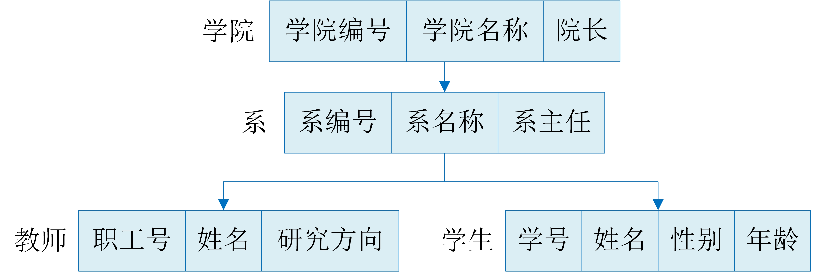
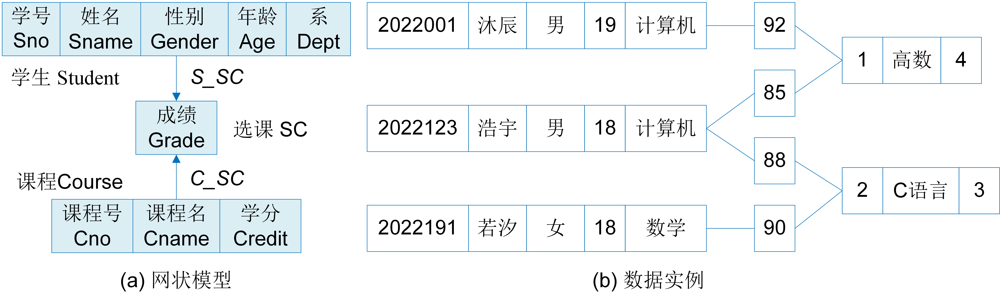

# 关系数据库概述

关系数据库（Relational Database）是目前软件应用中使用最多的一种数据管理系统。与文档数据库使用的面向对象的文档模型不同，关系数据库建立在关系模型基础之上，借助于集合代数等概念和方法来处理数据。不同的数据模型，其表达数据的能力和数据的处理方式也不同。本章将主要介绍关系数据库的相关知识。


## 关系数据库的产生

数据库是提供数据管理的有效技术，它是应数据管理任务的需求而产生的。数据管理技术先后经历了人工管理、文件系统和数据库系统三个阶段。

20世纪50年代中期以前，计算机世界里的外存设备只有纸带、卡片、磁带，没有操作系统。计算机主要用于科学计算，数据不需要长期保存，由应用程序自己进行定义和管理，数据即用即输入，用完即删除。20世纪50年代后期到60年代中期，计算机有了硬盘存储设备和操作系统。数据可以长期保存在外存，操作系统中的文件系统以文件形式来组织和管理数据，并提供文件读写接口实现数据的存取操作。数据内部的逻辑结构由应用程序自己进行定义和管理，并且一个或一组文件只对应一个应用程序。这使得应用程序的开发难度高，并且数据无法在多个应用中进行共享。20世纪60年代后期，数据规模越来越大，应用范围越来越广泛，多应用之间的数据共享需求越来越多，因此，统一的数据管理软件系统——数据库管理系统应运而生。

数据库管理系统的构建思想是将应用程序对数据管理的共同需求进行抽象，用数据模型来描述、组织和管理数据。应用程序基于数据模型提供的接口实现数据访问。数据库管理系统作为一个通用的数据管理模块服务于多个应用软件，实现了数据共享。最早出现的数据模型是层次模型（Hierarchical Model）和网状模型（Network Model）。由IBM公司研发的基于层次模型的IMS (Information Management System) 和由美国通用公司GE研发的基于网状模型的IDS (Integrated Data Store)也在商业上取得了成功。

20世纪70年代，美国IBM公司的研究员Edgar Frank Codd发现基于层次模型和网状模型的数据管理系统对应用软件开发并不友好。应用程序需要根据具体的数据模型来定义数据的访问路径，一旦数据模型发生改变，应用程序逻辑也要相应的改变。Codd认为数据的组织方式和应用程序之间应该是松耦合的。数据的访问方式由数据管理系统实现，而应用程序只需要告诉数据管理系统需要哪些数据。随后，Codd提出了关系模型（Relational Model）并得到了学术界和工业界的认可。40多年来，以关系模型为基础的关系数据库系统的研究和开发取得了辉煌的成就。关系数据库系统已成为最重要、应用最广泛的数据管理系统。典型的关系数据库有System R、Oracle、DB2、Mysql和Postgre SQL。

## 层次模型和网状模型的问题

<center>
	
	<br>
	<div display: inline-block; padding : 2px>
		图 4.1 教师学生数据库的层次模型
	</div>
</center>

层次模型用树形结构来表示各类实体和实体之间的联系。在树形结构中，有且只有一个结点没有双亲结点，即一个根结点，并且除根结点外，其他结点有且只有一个双亲结点。在层次模型中，每个结点对应一类实体（也称实体型），结点内的字段对应实体的属性，结点之间的有向边表示实体之间具有一对多的联系。图4.1展示了教师学生数据库的层次模型。图中包含学院、系、教师和学生四个实体型，其中，学院是根结点，系是学院的孩子结点，同时也是教师和学生的双亲结点。学院与系、系与教师、系与学生之间均具有一对多联系。层次模型能够自然直观地描述实体之间的一对多联系，如行政机构之间的关系、家族关系，但是对实体之间的非层次关系，如结点之间的多对多联系，则无法描述。

<center>
	
	<br>
	<div display: inline-block; padding : 2px>
		图 4.2 学生选课数据库的网状模型和数据实例
	</div>
</center>

网状模型用有向图结构来表示各类实体与实体之间的联系。它消除了层次模型的弊端，可以描述实体之间的多对多联系。在有向图结构中，允许存在多个无双亲的结点，并且一个结点可以有多个双亲结点。在网状模型中，结点可以描述一类实体，也可以描述实体之间的联系，结点之间的有向边表示实体之间具有一对多联系。图4.2展示了学生选课数据库的网状模型和数据实例。在学生选课应用中，一名学生可以选修多门课程，一门课程可以被多名学生选修，学生和课程之间具有多对多的选课联系。因此，该网状模型中包含学生、课程和选课三个结点。学生和选课之间的一对多联系用s\_sc表示，课程和选课之间的一对多联系用c\_sc表示。图中给出了学生选课应用的数据实例，包含三个学生对象，两个课程对象以及四条选课记录。它们之间通过实线连接，描述了学生的选课信息，如学生“浩宇”选修了“高数”，并取得了92分的成绩。

```bson
define student, course, sc
course.cname := "高数";
find any course using cname;
find first sc within c_sc；//通过课程与选课的联系找到课程Math对应的选课记录
While DB-status := 0 do
	begin 
	  find any student with s_sc;//通过学生与选课联系找到Math选课记录对应的学生
	  get student;
	  print (student.sname);
	  find next sc within c_sc；
	end
```

基于网状模型，应用程序如何访问数据对象呢？比如，查询选修“高数”这门课程的所有学生名称。应用程序的处理逻辑如上所示，主要包括以下步骤：

* 首先定义三个变量student、course、sc，分别对应网状模型中学生、课程和选课三个结点；
* 然后设置变量course的课程名称(cname)为“高数”，并通过课程名称找到对应的课程对象；
* 之后沿着“高数”课程对象的边c\_sc进行检索，找到选修高数课程的选课记录，最后再沿着选课记录的边s\_sc查找到对应的学生对象，并输出学生的姓名。由于课程和选课之间是一对多联系，所以检索过程使用while循环进行迭代查找，直到找到所有选修高数课程的选课记录。

应用程序将数据对象封装在变量中，通过对变量的操作实现了对数据库内的数据的访问。在访问过程中，应用程序根据数据的组织结构定义了数据的存取路径和处理逻辑。这种数据访问语言称为面向过程式的程序设计语言。

基于层次数据库和网状数据库构建应用软件系统时，程序员必须了解数据库内部的数据组织模式，根据数据模式来设计程序逻辑，这使得数据管理系统与软件系统之间的关系变得特别紧密。这种紧耦合的关系不仅加重了应用程序的编写负担还增加了系统的维护代价。一旦数据模式发生改变，应用程序也将进行重新编写。比如学生选课应用中，同一学期内一门课程可以开设多个教学班，那么网状模型中需要增加一个教学班结点，课程与班级之间存在一对多的联系，班级与选课之间存在一对多的联系，学生与选课之间存在一对多的联系。网状模型发生改变之后，数据的访问路径也发生了改变，因此查询选修“高数”课程的所有学生名称的程序也需要重新编写。虽然层次模型和网状模型能够直接、清晰地描述现实世界，但是它们对软件系统的开发工作并不友好。


## 关系数据库的构建思想

既然基于层次模型和网状模型的数据管理系统增加了软件系统的开发难度，违背了系统的信息隐藏原则，那么有必要去研究一个新型的数据管理系统。然而，一个好的数据管理系统应该具备哪些特征呢？Codd认为：

* 数据管理系统和应用程序之间应尽可能地保持相互独立。数据的存放方式、访问方式、索引使用都与应用程序无关。数据管理系统与应用程序之间的交互越简单越好，耦合度越低越好。
* 数据访问语言要能简洁、准确地描述应用需求。数据访问语言只需要描述应用需求需要哪些数据即可，至于如何获取数据则由数据库系统负责。
* 数据模型要能够直观地、清晰地描述现实世界，即实体和实体之间的联系。

这是设计数据管理系统的初衷。那么如何来设计满足条件的数据模型和数据访问语言呢？Codd借鉴了严格的数学理论，基于集合论的关系概念构建了关系模型，并基于数理逻辑的谓词演算提出了关系演算。关系模型其实是用二维表的形式来表示实体和实体间的联系。关系演算是用谓词逻辑来表达应用的查询需求。

逻辑是人类表达自己思想的最基本的方式。基于关系演算的数据访问语言不仅能够清晰、简练地描述用户需求，而且语法简单，便于程序员使用。例如，用关系演算来表达“查询选修高数的所有学生”。首先用谓词逻辑来表达该查询需求，定义$f(x)$表示$x$是一名学生，$g(y)$表示$y$是高数课程，$r(xy)$表示学生$x$选修了课程$y$，那么选修高数的学生表示为“$\exists x \exists y （f(x) \wedge   g(y) \wedge r(xy)）$”。然后将谓词逻辑转换为关系演算，在学生选课的关系模型中，有学生student、课程course和选课sc三个关系，即三张二维表，sc表中存储学号sno和课程号cno来描述学生和选课、课程和选课之间的一对多关系。关系演算表达式如下所示，其中 $student.sno = sc.sno \wedge sc.cno = course.cno $表示student关系中的学生选修了course关系中的课程，即$r(xy)$，$course.cname='高数'$表示高数课程，即$g(y)$, $student(t)$表示$t$是student关系中的记录，即$f(x)$。

> 谓词逻辑：<br>
> 令：$f(x): x 是一名学生; g(y): y是高数课程;  r(xy): x选修了课程y $ <br>
> 则 $\exists x \exists y （f(x) \wedge   g(y) \wedge r(xy)）$ 表示选修课高数的学生

> 关系演算：<br>
> 关系（表）：$student(sno,sname,gender), course(cno,cname,credit), sc(sno,cno,date,grade)$ <br>
> 令：$t 表示关系中的记录，R表示关系， R(t)表示t是关系R中的记录$ <br>
> 则 $\{ t |  (student(t) \wedge student.sno = sc.sno \wedge sc.cno = course.cno \wedge course.cname='高数')\}$ 表示选修高数课程的学生

基于关系演算的数据访问语言只表达了应用需要哪些数据，而不用定义数据如何获取，简化了数据管理系统与应用程序之间的交互。这种语言称为声明式程序语言。声明式程序语言还包括关系代数和结构化查询语言SQL（Structured Query Language）。它们统称为关系数据语言。关系代数使用关系的运算来表达应用需求，SQL是关系数据库的标准语言，具有关系代数和关系演算双重特点。

关系模型和关系数据语言刚提出的时候并未得到广泛的认同。因为让计算机能够识别和处理逻辑表达式，以及让数据管理系统实现数据的访问都是比较困难的。但在Codd的极力推广之下，越来越多的人员愿意投入大量的时间和精力去实现这些功能，直到上世纪70年代末80年代初期，历时6年的关系数据库系统System R才得以研制成功。之后，越来越多的关系数据库商业产品相继推出，并得到了广泛的使用。


