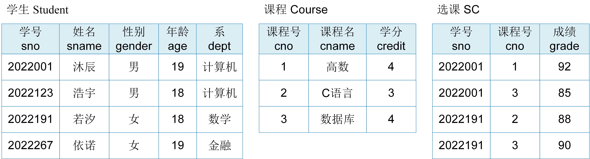

# 关系模型

关系模型由关系数据结构、关系操作和关系完整性约束三部分组成。本小节将对这三部分内容进行介绍。

## 关系结构

	
	 
	

		图 4.3 学生选课数据库的关系模型和数据实例
	

关系模型是将数据组织成一个个关系，关系表示现实世界中的各类实体以及实体之间的联系。通常，关系可以形象地理解为一张二维表，它建立在集合论的基础之上。

图4.3中展示了学生选课数据库的关系模型，其中包含学生Student、课程Course和选课SC三个关系。每个关系的逻辑结构是一张二维表，它由表头和表内记录组成。下面介绍几个关系模型的基本概念：

* 关系模式：表头在关系模型中称为关系模式（schema），它是对关系的描述。例如，学生关系的关系模式可以形式化表示为：学生（学号，姓名，性别， 年龄，系），其中“学生”是关系名，“学号”、“姓名”、“性别”、“年龄”、“系”是属性名。
* 属性：表中的每一列在关系模型中称为属性（attribute）。属性是对每类实体的特征抽象。比如，课程实体的特征可以抽象为课程号、课程名和学分。每一列属性值取自于一个域。域是一组具有相同数据类型的值的集合。例如，课程名属性值来自于长度小于25字节的字符串集合，学分来自于大于0小于5的正整数。
* 元组：表内记录中的每一行在关系模型中称为元组（tuple）。元组是对某一实体对象进行描述，由任意个属性值组成。例如，学生表中的第一行元组(2022001, ‘沐辰’, '男', 19, '计算机')描述的是学生“沐辰”对象。该元组表示学生沐辰的学号是2022001，属于计算机系。
* 关系：表中的所有记录在关系模型中称为关系，关系是元组的集合。如果元组由$n$个属性值组成，则元组对应的关系称为$n$元关系。比如课程和选课关系是三元关系，学生关系是五元关系。
* 候选码：在关系中，如果某一属性组的值能够唯一地标识一个元组，而其子集不能的，则该属性组称为候选码。候选码可以包含关系模式中的一个属性，多个属性，甚至是所有属性。候选码中的属性称为**主属性**，不包含在候选码中的属性称为**非主属性**或者**非码属性**。例如，学号是学生关系的候选码，学号和课程号是选课关系的候选码。此外，一个关系里也可以有多个候选码。例如，在仓库管理关系（仓库号，管理员号，商品号，商品数量）中，如果一个仓库只有一个管理员，一个管理员只管理一个仓库，那么仓库号和商品号是该关系的候选码，管理员号和商品号也是该关系的候选码。
* 主码：关系中的某一个候选码设置为主码（primary key）。例如，学生关系中学号是主码，课程关系中课程号是主码，选课关系中学号和课程号共同构成主码。

与文档模型相比，关系和文档集都是对各类实体的描述，元组和文档是对某一实体实例的描述。关系是元组的集合，文档集是文档的集合。在关系模型中，组成元组的各属性是提前进行严格定义的。每个元组必须包含关系模式中定义的所有属性，并且属性值需要遵循定义的数据类型和长度。而在文档模型中，组成文档的属性不用提前定义，并且同一文档集内，各文档之间的属性可以不同，相同属性的数据类型也可以不同。

## 关系操作

数据管理系统最基本的功能是实现数据的存取。关系数据库也提供了基于关系模型的数据存取操作CRUD，即插入（insert）、删除（delete）、修改（update）和查询（query）四类关系操作。关系具有很强的查询表达能力，查询操作还可以细分为选择（select）、投影（project）、连接（join）、除（divide）、并（union）、交（intersection）、差（except）、笛卡尔积等。关系操作构建于集合的基础之上，也就是说操作的对象和结果都是集合，也可以说操作的对象和结果都是关系。

关系模型定义了关系操作，但未对表达关系操作的方式和语言进行说明。早期的关系操作通常用代数方式或逻辑方式进行表示，分别称为关系代数（relational algebra）和关系演算（relational calculus）。后来，结构化查询语言SQL成为了关系数据库的标准语言，它不仅能够表示各类关系操作，而且还能定义数据和控制数据。如今，关系代数、关系演算和SQL统称为关系数据语言。如果一个关系数据语言能够表示关系代数可以表示的查询，则称该语言具有完备的表达能力，简称关系完备性。关系代数、关系演算和SQL语言已经被证明在表达能力上是等价的，都具有完备的表达能力。我们将在后面的章节中详细介绍关系代数和SQL语言。

## 关系完整性

关系模型的完整性是指关系需要遵循某种约束条件，这些约束条件是现实世界的需求。为了保证数据库中数据的正确性，任何关系在任何时刻都必须要满足这些语义约束。

关系完整性约束包括：实体完整性、参照完整性和用户定义完整性。其中实体完整性和参照完整性是关系模型必须保证的约束条件，由关系数据库系统支持。用户定义完整性是具体应用需要遵循的约束条件，由关系数据库提供定义和检验的功能。

> 学生关系：学生（学号，姓名，性别，年龄，系），其中学号是主码 。 
> 课程关系：课程（课程号，课程名，学分），其中课程号是主码。 
>  选课关系：选课（学号，课程号，成绩），其中学号和课程号是主码，也是外码。

实体完整性（entity integrity），也称主码约束，是指关系的主码属性值既不能重复也不能取空值。关系对应的是现实世界中的各类实体集。实体是可以相互区分、识别的，即他们具有唯一性识别。比如，学生关系中，每个学生都是独立的实体对象，他们是不一样。所以，在关系模型中，以主码作为唯一性标识。主码中的所有属性都不能取空值，并且主码的值不能重复，否则，表明关系中存在不可标识、不可区分的实体。比如，在选课关系中，学号和课程号是关系的主码，则学号和课程号两属性的值都不能为空值，并且任意两元组中的学号和课程号不能取相同的值。

参照完整性（Referential integrity），也称外码约束，是指建立实体之间联系的主码和外码的引用约束条件。在关系模型中，实体和实体之间的联系都是用关系来描述的，因此关系之间存在引用和被引用。比如，学生、课程和选课三个关系中，选课关系引用了学生关系的主码（学号）和课程关系的主码（课程号）。选课关系称为参照关系，学生关系和课程关系称为被参照关系。学号和课程号称为选课关系的外码。显然，选课关系中的学号的取值必须是存在学生关系中的学号，同样地，选课关系中的课程号的取值也必须是存在课程关系中的课程号。也就是说，参照完整性约束定义的是参照关系中的外码的取值必须来自于被参照关系中主码的取值。如果参照关系中的外码不是它的主码，那么外码也可以取空值。需要指出的是，参照关系和被参照关系可以是相同的关系也可以是不同的关系，主码和外码可以同名也可以不同名。

用户定义完整性（user-defined integrity）是指根据应用的需求，对应用的关系模型提出相应的约束条件。比如，某属性的取值可以为空，但必须唯一，即唯一约束；某属性的取值不能取空值，即非空约束；某属性的取值需要大于0等。对于此类约束一般不由应用程序提供，而是由关系模型提供定义和检验机制，并用统一的系统方法进行处理。

通常，关系模型的完整性约束同关系模型的关系模式一同定义。关系数据库的标准语言SQL提供了定义完整性约束的关键字，其中，"PRIMARY KEY"定义实体完整性，"FOREIGN KEY"和"REFERENCES"定义参照完整性，"UNIQUE"定义用户的唯一约束，"NOT NULL"定义用户的非空约束，"CHECK"定义用户的其他约束。

