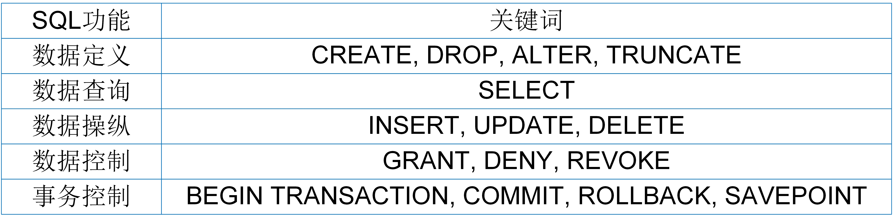

# SQL概述

结构化查询语言（Structured Query Language, SQL）是关系数据库的标准语言，也是一个通用的、具有完备表达能力的关系数据库语言。本章将详细介绍SQL的基本功能。

## SQL的产生

层次模型和网状模型使得数据库系统与应用程序之间耦合度过高，增加了软件系统的开发难度。为此，Edgar Frank Codd提出了关系模型和声明式程序语言（关系演算和关系代数），既能够直观地描述现实世界，准确地表达应用需求，又能够保持数据库系统与应用程序之间的独立性。但是，基于关系演算和关系代数的数据查询语言对程序员而言并不友好，有时会显得过于复杂，从而增加了应用程序的编程难度。

1974年，IBM工程师Boyce和Chamberlin在关系代数的基础上提出了一种新的查询语言SQL（最初称为SEQUEL），并在IBM公司研制的关系数据库管理系统原型System R上实现。基于SQL，程序员不再使用关系代数表达式，而是用一种更加直观的方式来表达应用需求。如何将SQL翻译成关系代数表达式，则由数据库系统内部实现。

由于SQL简单易学，功能丰富，一经推出便被各大数据库厂商采用。之后，经过不断地修改、扩充和完善，SQL得到了业界和国际标准化组织的认可，并形成了统一的SQL标准。目前，最新的SQL标准是SQL 2016，而最常用的标准是SQL92和SQL99。

## SQL的基本功能

SQL是一种面向集合操作的非过程式设计语言，既可以独立地用于命令行交互方式，又可以嵌入到高级语言供程序员设计程序使用。SQL语言用于实现对关系数据库的基本操作，如数据查询、更新和管理。按数据库的基本操作类型进行分类，SQL语言分为数据定义语言、数据查询语言、数据操纵语言、数据控制语言和事务控制语言五类，如图5.1所示。

	
	 
	

		图 5.1 SQL语言分类
	

* 数据定义语言（Data Definition Language, DDL）：定义数据库中的各类对象，如表、视图、索引、存储过程、触发器等。数据定义指令包括CREATE、DROP、ALTER、TRUNCATE。

* 数据查询语言（Data Query Language, DQL）：查询数据库中的数据。数据查询指令有SELECT。

* 数据操纵语言（Data Manipulation Language, DML）：插入、更新、删除数据库表中的数据。数据操纵指令包括INSERT、UPDATE、DELETE。

* 数据控制语言（Data Control Language, DCL）：授权和撤销用户对数据的访问权限。数据控制指令包括GRANT、DENY、REVOKE。

* 事务控制语言 （Transaction Control Language, TCL）：控制数据库操纵事务的执行。事务控制指令包括BEGIN TRANSACTION、COMMIT、ROLLBACK、SAVEPOINT。

与文档数据库系统相比，关系数据库系统提供的基本操作类型更丰富，数据访问指令也更加多样。文档数据库系统在查询和操纵数据之前不需要定义文档的格式，也就是说，插入同一个文档集中的文档格式可以不同。而关系数据库系统必须提前定义表的结构（关系模式），数据查询和操纵必须严格按照表的结构进行。比如，定义了一个包含4个属性的表结构，那么就不能插入拥有5个属性的元组。基于表结构的预先定义，关系数据库才能进行严谨的逻辑推导，描述更加复杂的应用需求。

