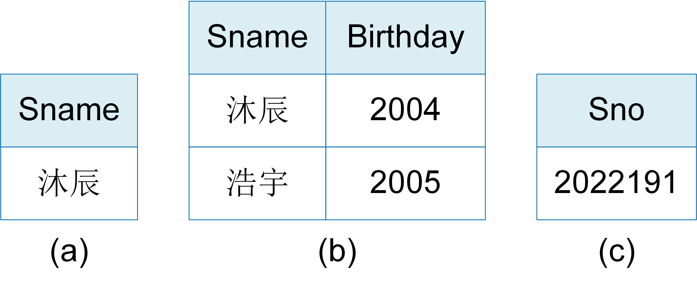
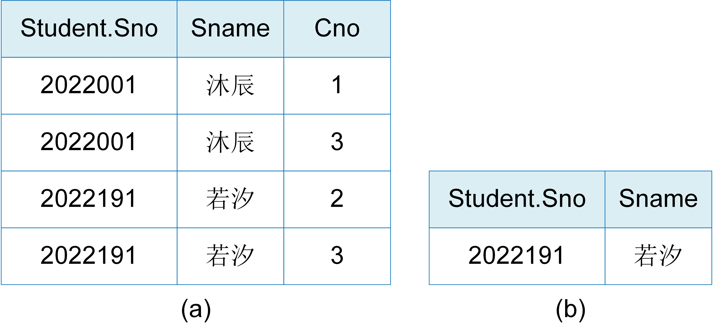
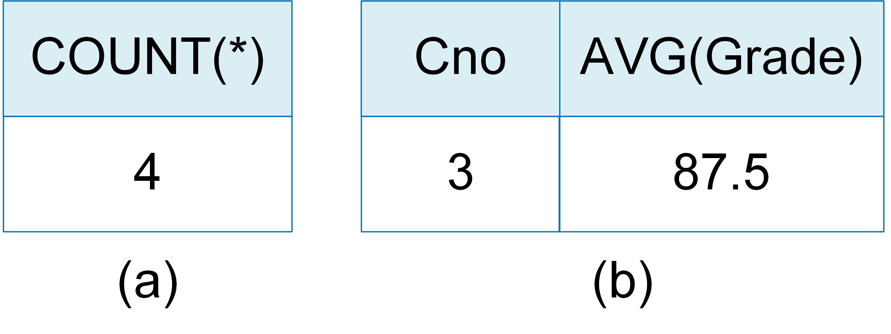
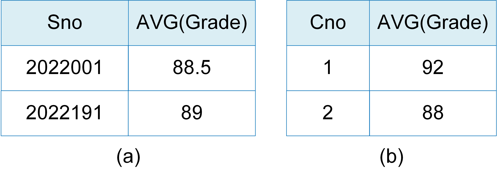
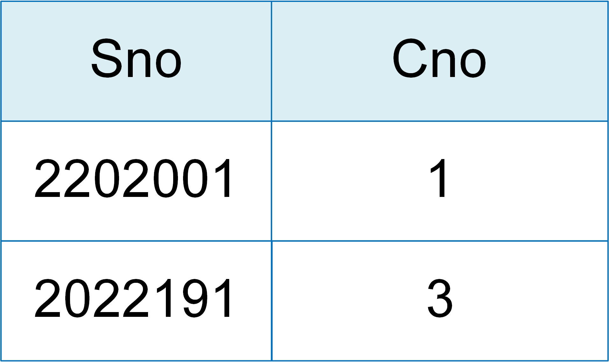

# 数据查询

一旦创建基础表并且插入数据之后，用户就可以利用SQL语句来查询想要的数据。数据查询是数据库的核心操作。SQL语言提供SELECT语句来查询数据，其基本格式如下：

```bson
SELECT [ALL | DISTINCT]  <目标列表达式> [，<目标列表达式>] ...
FROM <表名或视图名> [，<表名或视图名> ...] | (<SELECT 语句>) [AS] <别名> 
[WHERE <条件表达式>] 
[GROUP BY <列名1> [HAVING <条件表达式>]] 
[ORDER BY <列名2> [ASC | DESC] ];
```

查询语句主要由SELECT，FROM，WHERE三个关键词组成。SELECT子句后的目标列表达式表示要查询的属性列；FROM子句后可以是基础表、视图或者派生表，表示从它们中查询数据；WHERE子句中的条件表达式表明查询的数据需要满足的条件。另外，查询语句中还可以有GROUP BY子句和ORDER BY子句。GROUP BY引导分组聚集查询，它表示将结果按照<列名1>的值进行分组，ORDER BY子句表示查询结果按照<列名2>的值的升序或降序排序。 

SELECT语句既能够实现简单的单表查询，也能实现复杂的连接查询、聚集查询、嵌套查询和相关子查询等。下面以学生-课程数据库为例来说明SELECT语句的各种用法。


## 单表查询

单表查询是指仅涉及一个表的查询。选择表中满足查询条件的元组的全部或部分列即关系代数的选择和投影运算。下面给出了单表查询的例子。

<center>
	
	<br>
	<div display: inline-block; padding : 2px>
		图 5.3 单表查询示例
	</div>
</center>

> [例5.12] 查询学号为'2022001'的学生姓名。<br>
> &nbsp;&nbsp;&nbsp;&nbsp;SELECT Sname <br>
> &nbsp;&nbsp;&nbsp;&nbsp;FROM Student<br>
> &nbsp;&nbsp;&nbsp;&nbsp;WHERE Sno = '2022001'; <br>
> [例5.13] 查询学号为'2022001'的学生的全部信息。<br>
> &nbsp;&nbsp;&nbsp;&nbsp;SELECT * <br>
> &nbsp;&nbsp;&nbsp;&nbsp;FROM Student<br>
> &nbsp;&nbsp;&nbsp;&nbsp;WHERE Sno = '2022001'; <br>

例5.12查询语句的执行过程是：首先，利用在Sno上的主键索引从Student表中找到Sno='2022001'的元组；然后，从得到的元组中取出Sname列值形成最终的查询结果，如图5.3(a)。

如果想要查询学号为'2022001'的学生的全部信息，则可以简单地将SELECT后的<目标表达式>指定为*，如例5.13所示。

> [例5.14] 查询全体男学生的姓名及其年龄，查询结果按年龄的升序排列。<br>
> &nbsp;&nbsp;&nbsp;&nbsp;SELECT Sname, 2023-Age Birthday &nbsp; &nbsp;/\*查询结果的第2列是一个算术表达式, Age是该列的别名\*/<br>
> &nbsp;&nbsp;&nbsp;&nbsp;FROM Student<br>
> &nbsp;&nbsp;&nbsp;&nbsp;WHERE Gender = '男' <br>
> &nbsp;&nbsp;&nbsp;&nbsp;ORDER BY Birthday ASC <br>

由于在Gender上没有创建索引，该语句的执行过程是：对Student表进行全表扫描，依次取出表中的元组，检查元组在Gender列的值是否等于'男'。如果相等，则取出Sname列的值，并用当前的年份（2023年）减去学生的年龄得到学生的出生年份，Sname列值与学生年龄形成一个新的元组进行输出；否则跳过该元组，取下一个元组。重复上述操作，直到处理完Student表中的所有元组。最后，将查询结果按出生年份的升序排列。查询结果如图5.3(b)。

SELECT子句中的<目标表达式>不仅可以是表中的属性列，还可以是算术表达式，字符串常量、函数等。

> [例5.15] 查询考试成绩在88~90分(包括88和90分)之间的学生的学号。<br>
> &nbsp;&nbsp;&nbsp;&nbsp;SELECT DISTINCT Sno<br>
> &nbsp;&nbsp;&nbsp;&nbsp;FROM SC<br>
> &nbsp;&nbsp;&nbsp;&nbsp;WHERE Grade BETWEEN 88 AND 90; <br>

该语句的执行过程是：对SC表进行全表扫描，找出成绩在88分到90分之间的学生的学号。在SC表中，满足查询条件的元组有两条且学号都为'2022191'。查询语句中的DISTINCT关键词表示当一个学生有多门课程不及格时，他的学号也只列一次，即去掉重复的行。查询结果如图5.3(c)。如果不想去掉重复的行，则指定ALL关键词或者不指定任何关键词。

WHERE子句中<条件表达式>常用的表达式包括：比较表达式、确定范围表达式，确定集合表达式，字符匹配表达式，空值表达式以及逻辑运算表达式。详细地使用可以参照关系数据库系统的用户使用手册。


## 多表查询
多表查询是指同时涉及两个或两个以上表的查询，也称之为连接查询。连接查询是关系数据库中最主要的查询，对应关系代数的连接运算，包括等值连接查询、自然连接查询、非等值连接查询、自身连接查询、外连接查询和复合条件连接查询等。

下面给出了常用的自然连接查询和复合条件连接查询的例子。

> [例5.16] 查询每个学生的学号、姓名及其选修课程号。<br>
> &nbsp;&nbsp;&nbsp;&nbsp;SELECT Student.Sno, Sname, Cno<br>
> &nbsp;&nbsp;&nbsp;&nbsp;FROM Student, SC<br>
> &nbsp;&nbsp;&nbsp;&nbsp;WHERE Student.Sno = SC.Sno; <br>

在上例中，学生的学号和姓名存放在Student表中，学生选修课程名存放在SC表中，查询实际上涉及了Student和SC两个表，所以需要先将两张表连接起来，然后基于连接结果获取想要的信息。两个表之间的连接通过公共属性Sno实现，连接条件为Student.Sno = SC.Sno，放于WHERE关键词之后。在上例中，由于Sname，Cno属性列在Student表和SC表中是唯一的，因此引用时可以不加表名前缀；而Sno在两个表中都出现了，因此引用时必须加上表名前缀，这是为了避免混淆。

该连接查询的一种可能执行过程是：首先在Student表中找到第一个元组，然后从头开始扫描SC表，逐一查找与Student第一个元组的Sno相等的SC元组，找到之后将Student的第一个元组与该元组拼接起来，然后取出Student表的Sno, Sname属性列和SC的Cno属性列形成查询结果的一个元组。直到SC表的全部元组查找完之后，再找Student表的第二个元组，重复上述才做，直到Student表中的全部元组处理完毕。查询结果如图5.4(a)。

> [例5.17] 查询选修3号课程且成绩在90分及以上的所有学生的学号和姓名。<br>
> &nbsp;&nbsp;&nbsp;&nbsp;SELECT Student.Sno, Sname<br>
> &nbsp;&nbsp;&nbsp;&nbsp;FROM Student, SC<br>
> &nbsp;&nbsp;&nbsp;&nbsp;WHERE Student.Sno = SC.Sno AND SC.Cno = '3' AND SC.Grade >= 90; <br>

WHERE子句中可以同时包含多个连接条件和多个选择条件，多个条件之间由关键词AND连接。该查询的执行过程是：先从SC表中找到Cno='3'并且Grade>=90的元组形成一个中间结果，然后将中间结果和Student表中满足连接条件的元组进行连接获得最终的结果。也就是说，当WHERE子句中同时有连接条件和选择条件时，先执行选择条件再执行连接条件。查询结果如图5.4(b)。

<center>
	
	<br>
	<div display: inline-block; padding : 2px>
		图 5.4 多表查询示例
	</div>
</center>


##  聚集查询
SQL除了提供查询功能之外，还提供了计算功能。在关系数据库中，数据被组织成表的形式。基于表的形式可以做数据统计和分析。SQL提供了许多函数来实现统计，这些函数被称为聚集函数，查询称为聚集查询。

常用的聚集函数有：

```bson
COUNT(*)                          /*统计元组个数*/
COUNT( [DISTINCT | ALL] <列名> )  /*统计一列中值的个数*/
SUM( [DISTINCT | ALL] <列名> )    /*计算一列值的总和（此列必须是数值型）*/
AVG( [DISTINCT | ALL] <列名> )    /*计算一列值的平均值（此列必须是数值型）*/
MAX( [DISTINCT | ALL] <列名> )    /*算一列值中的最大值*/
MIN( [DISTINCT | ALL] <列名> )    /*计算一列值中的最小值*/
```
如果指定DISTINCT短语，则表示在计算时要取消指定列种的重复值。如果不指定DISTINCT或者指定ALL（ALL为默认值），则表示不取消重复值。

下面给出了聚集查询例子，其查询结果分别如图5.5(a)和5.5(b)所示。
> [例5.18] 查询学生总人数。<br>
> &nbsp;&nbsp;&nbsp;&nbsp;SELECT COUNT(*)<br>
> &nbsp;&nbsp;&nbsp;&nbsp;FROM Student;<br>
> [例5.19] 计算选修3号课程的学生平均成绩。<br>
> &nbsp;&nbsp;&nbsp;&nbsp;SELECT Cno, AVG(Grade)<br>
> &nbsp;&nbsp;&nbsp;&nbsp;FROM SC<br>
> &nbsp;&nbsp;&nbsp;&nbsp;WHERE  Cno = '3';<br>

<center>
	
	<br>
	<div display: inline-block; padding : 2px>
		图 5.5 聚集查询示例
	</div>
</center>

##  分组聚集
GROUP BY引导的分组聚集是一种复杂的聚集查询，它首先将查询结果按某一列或多列的值进行分组，值相等的为一组，然后对每一分组使用聚集函数进行计算。

> [例5.20] 查询学生的学号及其平均成绩。<br>
> &nbsp;&nbsp;&nbsp;&nbsp;SELECT Sno,AVG(Grade)<br>
> &nbsp;&nbsp;&nbsp;&nbsp;FROM SC<br>
> &nbsp;&nbsp;&nbsp;&nbsp;GROUP BY Sno;<br>

该语句的执行过程是：首先读取SC表的所有元组并按照Sno的值进行分组，根据Sno的值可以分为'2022001'和'2022191'两组，然后在每一组上求成绩的平均值。查询结果如图5.6(a)所示。

注意：在分组聚集查询SQL中，SELECT子句中的<目标表达式>只能是分组属性列或者聚集函数，而不能是其他属性列。比如，在例5.20中的<目标表达式>不能是Cno属性列。这是因为，分组聚集查询要求查询结果中每个分组只能有一条记录。例5.20是按Sno进行分组，每个分组上Sno是唯一的，聚集运算的结果也是唯一的，但每个分组中的Cno不是唯一的，所以Cno不能作为其查询属性列。

在实际应用中，有时还需要对分组聚集的结果做进一步的筛选。为此，SQL提供了HAVING关键词来制定筛选条件。

> [例5.21] 查询平均成绩大于等于88分的课程号和课程平均成绩。<br>
> &nbsp;&nbsp;&nbsp;&nbsp;SELECT Cno,AVG(Grade)<br>
> &nbsp;&nbsp;&nbsp;&nbsp;FROM SC<br>
> &nbsp;&nbsp;&nbsp;&nbsp;GROUP BY Cno<br>
> &nbsp;&nbsp;&nbsp;&nbsp;HAVING AVG(Grade)>=88;<br>

该语句的执行过程是：首先按Cno的值将SC表分为3组，然后再用聚集函数AVG(Grade)计算每一组的平均成绩，最后再根据HAVING的条件表达式筛选出平均成绩大于等于88的分组并输出。查询结果如图5.6(b)所示。

<center>
	
	<br>
	<div display: inline-block; padding : 2px>
		图 5.6 分组聚集查询示例
	</div>
</center>

注意：WHERE和HAVING关键词都可引导选择条件表达式，但是二者作用的对象不同。WHERE子句作用于基本表或者视图，从中选择满足条件的元组；HAVING子句作用于分组，从中选择满足条件的组。聚集函数不能用于WHERE子句中，只能用于SELECT和GROUP BY的HAVING子句。

##  嵌套查询
除了连接查询，SQL还提供了嵌套的方式来实现从多张表中获取信息。在SQL语言中，一个SELECT-FROM-WHERE语句称为一个查询块。将一个查询块嵌套在另一个查询块的WHERE子句或HAVING子句的条件中的查询称为嵌套查询（nested query）。

下例展示了一个最简单的嵌套查询。
> [例5.22] 查询选修了3号课程的学生名字。<br>
> &nbsp;&nbsp;&nbsp;&nbsp;SELECT Sname<br>
> &nbsp;&nbsp;&nbsp;&nbsp;FROM Student<br>
> &nbsp;&nbsp;&nbsp;&nbsp;WHERE Sno IN<br>
> &nbsp;&nbsp;&nbsp;&nbsp;&nbsp;&nbsp;&nbsp;&nbsp;&nbsp;(SELECT Sno<br>
> &nbsp;&nbsp;&nbsp;&nbsp;&nbsp;&nbsp;&nbsp;&nbsp;&nbsp;&nbsp;FROM SC<br>
> &nbsp;&nbsp;&nbsp;&nbsp;&nbsp;&nbsp;&nbsp;&nbsp;&nbsp;&nbsp;WHERE Cno='3');<br>

该SQL语句有两个查询块。SELECT Sname FROM Student WHERE Sno IN是外层查询块，也称为外层查询或父查询；SELECT Sno FROM SC WHERE Cno='3'是内层查询块，嵌套在外层查询块的WHERE条件中，内层查询块称为内层查询或子查询。

该语句的执行过程是：首先执行子查询，父查询将子查询的结果视为一张基础表，然后在基础表上执行查询，即由内向外进行处理。查询结果如图5.7所示。

<center>
	
	<br>
	<div display: inline-block; padding : 2px>
		图 5.7 嵌套查询示例
	</div>
</center>

例5.22的查询也可以用连接查询来实现。
> 例5.22查询请求的另一种SQL表示。<br>
> &nbsp;&nbsp;&nbsp;&nbsp;SELECT Sname<br>
> &nbsp;&nbsp;&nbsp;&nbsp;FROM Student, SC<br>
> &nbsp;&nbsp;&nbsp;&nbsp;WHERE Student.Sno = SC.Sno AND SC.Cno='3';<br>

可见，同一个查询请求可以有多种不同的SQL表示方式。相对而言，嵌套查询的逻辑更加清晰，易于构造，具有结构化程序设计的优点；连接查询的SQL会更加简洁一些，而且商用关系数据库管理系统对连接查询的优化做得完善一些。所以，在实际应用中，连接查询使用更加广泛。

此外，SQL语言允许多层嵌套查询，即一个子查询中还可以嵌套其他子查询。需要特别指出的是，子查询的SELECT语句中不能使用ORDER BY子句，ORDER BY子句只能对最终查询结果进行排序。

上例展示的是带有IN谓词的子查询。除此之外，常使用的还有带有比较运算符的子查询、带有ANY（SOME）或ALL谓词的子查询以及带有EXISTS谓词的子查询。下例展示了带有ALL谓词的子查询。其他子查询的使用，用户可以参考其他教材或使用说明书。

> [例5.23] 查询学生表中年龄比所有男生年龄都大的学生姓名和年龄。<br>
> &nbsp;&nbsp;&nbsp;&nbsp;SELECT Sname, Age<br>
> &nbsp;&nbsp;&nbsp;&nbsp;FROM Student<br>
> &nbsp;&nbsp;&nbsp;&nbsp;WHERE Age >ALL <br>
> &nbsp;&nbsp;&nbsp;&nbsp;&nbsp;&nbsp;&nbsp;&nbsp;&nbsp;(SELECT Age<br>
> &nbsp;&nbsp;&nbsp;&nbsp;&nbsp;&nbsp;&nbsp;&nbsp;&nbsp;&nbsp;FROM Student<br>
> &nbsp;&nbsp;&nbsp;&nbsp;&nbsp;&nbsp;&nbsp;&nbsp;&nbsp;&nbsp;WHERE Gender='男');<br>

##  相关嵌套查询

例5.22和例5.23的嵌套查询相对比较简单，子查询的查询条件不依赖于父查询，这种子查询称为不相关子查询。如果子查询的查询条件依赖于父查询，这类子查询称为相关子查询，包含相关子查询的查询语句称为相关嵌套查询。

> [例5.24] 查询每个学生超过他自己选修课程平均成绩的课程号。<br>
> &nbsp;&nbsp;&nbsp;&nbsp;SELECT Sno, Cno<br>
> &nbsp;&nbsp;&nbsp;&nbsp;FROM SC x<br>
> &nbsp;&nbsp;&nbsp;&nbsp;WHERE Grade >= <br>
> &nbsp;&nbsp;&nbsp;&nbsp;&nbsp;&nbsp;&nbsp;&nbsp;&nbsp;(SELECT AVG(Grade)<br>
> &nbsp;&nbsp;&nbsp;&nbsp;&nbsp;&nbsp;&nbsp;&nbsp;&nbsp;&nbsp;FROM SC y<br>
> &nbsp;&nbsp;&nbsp;&nbsp;&nbsp;&nbsp;&nbsp;&nbsp;&nbsp;&nbsp;WHERE y.Sno=x.Sno);<br>

上例中父查询的表出现在子查询的选择条件中，该子查询则为相关子查询。相关子查询的执行过程与不相关子查询不同，它需要将父查询的表中的每一个元组代入子查询，得到子查询的结果之后，再将子查询的结果代入父查询。上例查询的执行过程是：首先，从父查询的SC表中取出第一个元组，将该元组的Sno值（2022001）代入子查询；然后，执行子查询SELECT AVG(Grade) FROM SC y WHERE y.Sno='2022001'，计算该学生所修课程的平均成绩88.5；随后，将计算的平均成绩作为子查询结果，然后执行父查询SELECT Sno,Cno FROM SC x WHERE Grade >= 88.5，得到结果（2022001,1）；之后，取出父查询表中的下一个元组重复上述操作，直到父查询表中的元组全部处理完毕。查询结果如图5.8所示。

<center>
	
	<br>
	<div display: inline-block; padding : 2px>
		图 5.8 相关子查询示例
	</div>
</center>


