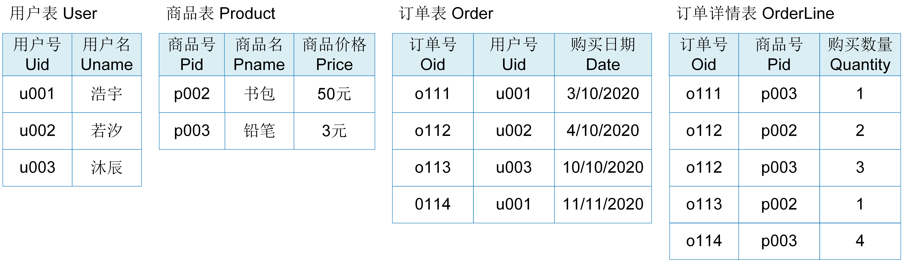

# 规范化与数据冗余

关系数据库设计是针对一个具体的应用构造一个合适的关系数据库模式。一个好的关系模式才能构建出一个高效的应用系统。本小节将重点介绍如何衡量一个关系模式的好坏。

## 数据冗余
> [例6.1] 建立一个描述用户购物的数据库，该数据库涉及的对象信息包括购物订单号（Oid）、用户号（Uid）、用户名字（Uname）、商品号（Pid）、商品名字（Pname）、商品价格（Price）、购买商品数量（Quantity）和购买日期（Date）。假设用一个单一的关系模式订单Order来表示，该关系模式为: 
> &nbsp;&nbsp;&nbsp;&nbsp;&nbsp;&nbsp;&nbsp;&nbsp;Order(<u>Oid, Uid</u>,Uname,<u>Pid</u>,Pname,Price,Quantity,Date),其中Oid、Uid和Pid为主码 

	
	 
	

		图 6.4 用户购物的单一模式Order
	

图6.4是某一时刻关系模式Order的一个实例，即数据表，表中存储了三个用户购买两类商品的记录。很明显，该表中存在数据冗余，比如，每个用户的名字重复出现，出现次数与该用户购买商品的次数相同；每个商品的名字和价格重复出现，出现次数与该商品被购买的次数相同；每个订单的购买日期重复出现，出现的次数与该订单出现的次数相同。从表中删除这些冗余信息不会影响数据的完整性，但存储冗余信息却会带来以下负面影响：

* 数据冗余会浪费大量的存储空间；
* 数据冗余会增加更新操作的代价，比如，将铅笔的价格调整为2元，必须更新表中所有购买铅笔的记录。

所以，Order关系模式不是一个好的模式。一个好的模式不会增加更新代价，数据冗余应尽可能少。

什么原因导致了数据冗余呢？

Order关系模式的主码是订单号Oid、用户号Uid和商品号Pid，也就是通过Oid、Uid和Pid可以唯一确定一条记录。而冗余数据用户名Uname由用户号Uid唯一确定，即一个用户号只对应一个用户名，商品名Pname和商品价格Price由商品号Pid唯一确定，即一个商品号只对应一个商品名和商品价格，购物日期Date由订单号Oid唯一确定，即一个订单号只对应一个购物日期。Uname、Pname、Price、Date都不是由主码唯一确定的属性。所以，一旦关系模式中包含不由主码唯一确定的属性，就会造成数据冗余。

一个关系内部属性与属性之间的一种约束关系称为函数依赖（Functional Dependency, FD）。这种约束关系是通过属性间值的相等与否体现出来的数据间相关联系。它是现实世界属性间相互联系的抽象。

在用户购物实例中，现实实际已知的事实（语义）是：

* 一个用户只有一个用户名；
* 一个商品只有一个商品名和价格；
* 一个用户可以有多个购物订单，但一个购物订单只属于一个用户；
* 一个用户可以购买多个商品，一个商品也可以被多个用户购买；

订单Order关系模式中存在如下的函数依赖：

* Uid -> Uname，称为用户名Uname函数依赖于用户号Uid；
* Pid -> Pname,  称为商品名Pname函数依赖于商品号Pid;
* Pid -> Price，称为商品价格Price函数依赖于商品号Pid；
* Oid -> Date， 称为购买日期Date函数依赖于订单号Oid;
* （Oid,Uid,Pid）-> Quantity, 称为购买的商品数量Quantity函数依赖于订单号Oid、用户号Uid和商品号Pid;

其中，（Oid,Uid,Pid）-> Quantity中Quantity依赖的是关系模式Order的主码，这种函数依赖称为完全函数依赖，而其他函数依赖中被依赖的属性不是主码，这种函数依赖称为部分函数依赖。关系模式中如果包含这种部分函数依赖就会出现数据冗余。

## 规范化
用户购物实例的另一种数据库设计使用用户User、商品Product、订单Order、订单详情OrderLine四个关系模式来描述。
> [例6.2] 用户购物实例的另一种关系数据库设计，关系模式如下： 
> &nbsp;&nbsp;&nbsp;&nbsp;User(<u>Uid</u>,Uname),其中Uid为主码 
> &nbsp;&nbsp;&nbsp;&nbsp;Product(<u>Pid</u>,Pname,Price),其中Pid为主码 
> &nbsp;&nbsp;&nbsp;&nbsp;Order(<u>Oid, </u> Uid,Date),其中Oid为主码 
> &nbsp;&nbsp;&nbsp;&nbsp;OrderLine(<u>Oid, Pid</u>,Quantity),其中Oid和Pid为主码 

	
	 
	

		图 6.5 用户购物的四个模式User、Product、Order、OrderLine
	

图6.5是某一时刻用户购物数据库的实例，该数据库中存储了三个用户购买两类商品的记录。与图6.4相比，图6.5的数据库表中没有数据冗余，存储空间得到了大大的提升，更新操作也不会造成额外的代价，如将铅笔的价格调整为2元时，只需要修改商品Product表中的一行记录。

通常，将这种不存在数据冗余的数据库设计称为规范化设计（Normalization）。规范化设计的一个强有力工具是关系数据库的规范化理论，它通常按属性间的函数依赖情况来区分关系规范化的程度，满足不同规范化程度要求的称为不同的范式。常用的范式有第一范式（1NF）、第二范式（2NF）、第三范式（3NF）、BCNF范式和第四范式（4NF），其中1NF的规范化程度最低，4NF的规范化程度最高。对各类范式定义感兴趣的读者可以参看其他资料。

规范化的基本思想是逐步消除关系模式中的数据冗余，所以，关系模式的规范化程度越高数据冗余越少。怎样才能得到一个具有较高规范化的关系模式呢？通常，一个高范式的关系模式可以通过对低范式的关系模式的模式分解（Schema Decomposition）而得到，例如，满足1NF的关系模式可以通过模式分解转换为若干个满足3NF的关系模式的集合。模式分解的关键在于消除关系模式中的冗余数据。其实，模式分解方法在实际应用开发过程中并不常用。在数据库设计过程中，只要能设计一个好的概念模型E-R图，基于E-R图转换关系模式的规则就能得到一个较高规范化程度的关系模式。

## 数据冗余的好处

规范化理论为数据库设计提供了理论的指南和工具，但并不是规范化程度越高关系模式就越好，必须结合应用环境和现实世界的具体情况合理地设计数据库模式。在实际应用开发中，某些应用也常常使用非规范化（Denormalization）的关系模式。

> [例6.3] 查询每天单笔订单中销售额大于1000的商品名和购买该商品的用户名 
> 基于单一关系模式Order的查询语句SQL1 
> &nbsp;&nbsp;&nbsp;&nbsp;SELECT Uname, Pname 
> &nbsp;&nbsp;&nbsp;&nbsp;FROM Order 
> &nbsp;&nbsp;&nbsp;&nbsp;WHERE Date = ‘’ AND Price\*Quantity > 1000; 
> 
> 基于关系模式User、Product、Order和OrderLine的查询语句SQL2
> &nbsp;&nbsp;&nbsp;&nbsp;SELECT User.Uname,Product.Pname 
> &nbsp;&nbsp;&nbsp;&nbsp;FROM User,Product,Order,OrderLine 
> &nbsp;&nbsp;&nbsp;&nbsp;WHERE Order.Uid = User.Uid AND 
> &nbsp;&nbsp;&nbsp;&nbsp;&nbsp;&nbsp;&nbsp;&nbsp;&nbsp;&nbsp;&nbsp;&nbsp;&nbsp;&nbsp;&nbsp;&nbsp;&nbsp;&nbsp;Order.Oid = OrderLine.Oid AND 
> &nbsp;&nbsp;&nbsp;&nbsp;&nbsp;&nbsp;&nbsp;&nbsp;&nbsp;&nbsp;&nbsp;&nbsp;&nbsp;&nbsp;&nbsp;&nbsp;&nbsp;&nbsp;OrderLine.Pid = Product.Pid AND  
> &nbsp;&nbsp;&nbsp;&nbsp;&nbsp;&nbsp;&nbsp;&nbsp;&nbsp;&nbsp;&nbsp;&nbsp;&nbsp;&nbsp;&nbsp;&nbsp;&nbsp;&nbsp;Order.Date ='' AND Product.Price\*OrderLine.Quantity > 1000; 

假设，在用户购物应用中，商家需要查询每天单笔订单中销售额大于1000的商品名和购买该商品的用户名。对于例6.1的数据库设计来说，实现该功能只需要查询订单表Order即可，如例6.3的SQL1。但是，对于例6.2的数据库设计来说，实现该功能需要执行用户表User、商品表Product、订单表Order和订单详情表OrderLine之间的连接操作，如例6.3的SQL2。多表连接操作的执行代价要远远高于单表的查询操作，所以SQL2的查询效率要远低于SQL1的查询效率。

通过例6.3可以得出一个结论：数据冗余虽然会带来存储和更新操作代价，但也能提高查询效率。数据冗余是一把双刃剑。在数据库设计时，应用开发者要结合具体应用，分析数据冗余的利弊，如果数据冗余的利大于弊，则可以使用非规范化的关系模式，否则使用规范化的关系模式。通常，适合使用非规范化数据库设计的应用具有以下特点：

* 冗余数据不需要过多的存储空间；
* 冗余数据不会被经常更新，或者冗余数据的更新代价不大；
* 冗余数据经常被查询，且能提高应用的查询效率。

## 合理利用数据冗余

> [例6.4] 用户购物数据库中拥有商品Product和订单详情OrderLine两个关系模式 ： 
> &nbsp;&nbsp;&nbsp;&nbsp;Product(<u>Pid</u>,Pname,Price),其中Pid为主码 
> &nbsp;&nbsp;&nbsp;&nbsp;OrderLine(<u>Oid, Pid</u>,Quantity),其中Oid和Pid为主码 
> 统计某个商品的总销售额，其查询SQL3如下： 
> &nbsp;&nbsp;&nbsp;&nbsp;SELECT Sum(Quantity)*Price 
> &nbsp;&nbsp;&nbsp;&nbsp;FROM Product, OrderLine 
> &nbsp;&nbsp;&nbsp;&nbsp;WHERE Product.Pid = OrderLine.Pid AND Product.Pid = ''；

假设，在用户购物应用中，商家需要经常统计某个商品的总销售额，该功能的查询功能如例6.4的SQL3所示。SQL3中包含商品表Product和订单详情表OrderLine的连接操作，执行该连接运算时需要对订单详情表进行全表扫描，因此SQL3的执行效率非常低。

如何优化数据库设计来提高查询效率呢？直观的方法是存储冗余信息，避免Product表和OrderLine表的连接查询，同时还需要考虑冗余数据的存储代价和更新代价。优化方案有以下两种。

> 方法一： 
> &nbsp;&nbsp;&nbsp;&nbsp;Product(<u>Pid</u>,Pname,Price,**TotalQuantity**)   
> 统计某个商品的总销售额，其查询SQL4如下： 
> &nbsp;&nbsp;&nbsp;&nbsp;SELECT TotalQuantity*Price 
> &nbsp;&nbsp;&nbsp;&nbsp;FROM Product 
> &nbsp;&nbsp;&nbsp;&nbsp;WHERE Product.Pid =' '； 
> 每次产生新订单时，需要更新购买商品的总销售量： 
> &nbsp;&nbsp;&nbsp;&nbsp;UPDATE Product 
> &nbsp;&nbsp;&nbsp;&nbsp;SET TotalQuantity = TotalQuantity + '购买数量' 
> &nbsp;&nbsp;&nbsp;&nbsp;WHERE Product.Pid =' '；

方法一，在商品表中冗余存储商品的总销售量，即在商品表中增加总销售量属性TotalQuantity，那么统计某个商品的总销售额可以改写为查询语句SQL4。SQL4只需要查询Product表并且通过主码的索引进行查询，查询效率非常高。冗余存储TotalQuantity带来的代价是每次购买商品时需要同步更新该商品的总销售量。该更新代价几乎不会影响应用性能，是可以接受的。

> 方法二： 
> &nbsp;&nbsp;&nbsp;&nbsp;Product(<u>Pid</u>,Pname,Price,**TotalSales**)   
> 统计某个商品的总销售额，其查询SQL5如下： 
> &nbsp;&nbsp;&nbsp;&nbsp;SELECT TotalSales 
> &nbsp;&nbsp;&nbsp;&nbsp;FROM Product 
> &nbsp;&nbsp;&nbsp;&nbsp;WHERE Product.Pid =' '； 
> 每次产生新订单时，需要更新购买商品的总销售量： 
> &nbsp;&nbsp;&nbsp;&nbsp;UPDATE Product 
> &nbsp;&nbsp;&nbsp;&nbsp;SET TotalSales = TotalSales + price *  '购买数量'  
> &nbsp;&nbsp;&nbsp;&nbsp;WHERE Product.Pid =' '；

方法二，在商品表中冗余存储商品的总销售额TotalSales，那么统计商品的总销售额可以改写为查询语句SQL5，该查询语句的执行效率非常高。冗余存储TotalSales带来的代价是每次购买商品时需要同步更新该商品的总销售额。该更新操作只需要更新一条记录，几乎不会对应用性能造成任何影响，所以数据冗余的代价是可接受的。

数据冗余这种思想不仅用于数据库设计，也常常用于应用软件系统的构建和数据库管理系统的设计。构建应用软件系统时，开发者会在后端服务器和前端服务器上缓存经常访问的数据。后端服务器的数据缓存可以减少从数据库管理系统读取数据的IO开销，前端服务器的数据缓存可以降低数据传输的网络开销和CPU处理开销，从而提高系统的请求处理性能。数据库管理系统内部也常使用缓存机制和索引来提高数据查询效率。缓存机制和索引都是冗余思想的一种体现。

