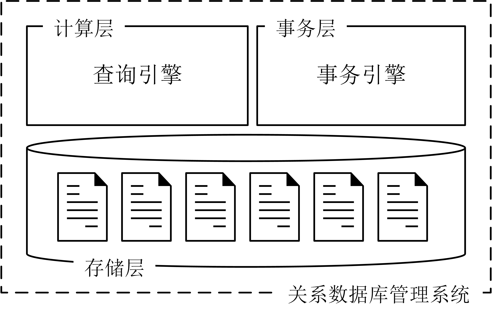
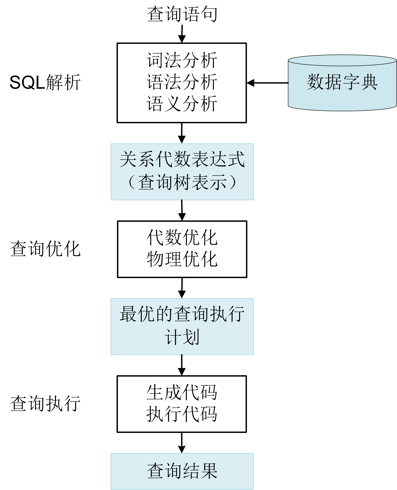
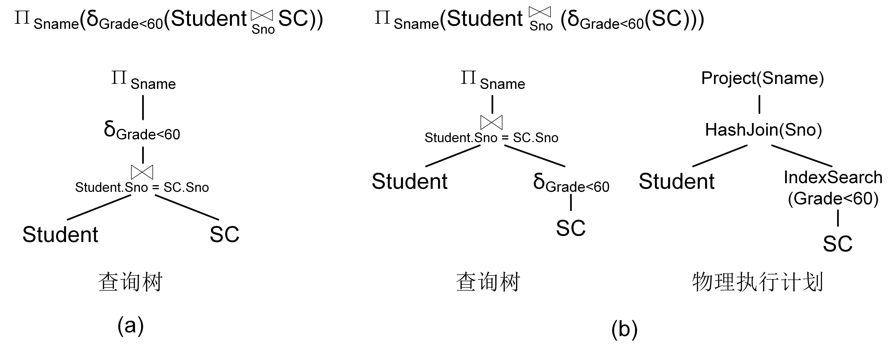

# 查询处理概述

查询处理是关系数据库管理系统处理SQL查询语句的过程。其任务是把用户提交给关系数据库管理系统的SQL查询语句转换为查询执行计划。

## 关系数据库的基本框架

当开发应用程序时，通常使用关系数据库管理系统来管理数据。上层应用软件通过SQL语言与数据库管理系统进行交互。当SQL查询语句传输给数据库管理系统后，系统是如何进行处理的呢？

	
	 
	

		图 7.1 关系数据库管理系统的基本架构
	

弄清这个问题之前，我们先来看看关系数据库管理系统的内部架构。如图7.1所示，数据库管理系统架构包括存储层、计算层和事务层。存储层负责组织和存储数据，计算层负责执行SQL查询语句，它首先根据查询语句从存储层读取数据，计算之后得到查询结果，然后返回给上层应用软件。事务层负责处理事务（将在第八章中介绍）。之前介绍文档数据库管理系统时并没有介绍计算层，这是因为它的计算相对简单，主要的功能集中在存储层，即数据如何存取。然而，关系数据库管理系统的SQL语言具有较强的表达能力。处理查询语言时不仅需要从存储层读取数据还需要进行大量计算。因此，关系数据库管理系统的查询处理涉及存储层和计算层。

在关系数据库管理系统中，数据被组织成表的形式，每张表里可以有多个属性和多个元组。那么表如何进行存储呢？与文档数据库管理系统一样，关系数据库管理系统将磁盘划分成多个物理页（页的大小可以是4MB或者8MB），表按行或者按列存放在物理页中。以按行存放为例，每个物理页中可以存放多个元组（行），表中的元组可以存放在多个物理页中，最后再通过一个数据结构将表内数据所存储的物理页串联起来。这个结构称为表头，每张表都有一个表头，它可以是Innode数据结构也可以是索引结构，如B+树结构。基于Innode和索引结构可以实现对表中数据的存取操作。

数据存储之后，用户可以基于SQL语句对数据进行访问。SQL查询语句的执行由计算层的查询处理模块负责，它首先需要将SQL语句解析为计算机能处理的关系代数表达式，然后根据关系表达式来选择合适的数据存取方式和关系运算的实现算法。

## 查询处理步骤
关系数据库管理系统的查询处理分为3个步骤：SQL解析（SQL Interpretation）、查询优化（Query Optimization）和查询执行（Query Execution），如图7.2所示。

	
	 
	

		图 7.2 查询处理步骤
	

* SQL解析：将SQL语句转换成关系代数表达式。首先，对查询语句进行词法分析，识别出SQL关键词、属性名和关系名等；然后进行语法检查和语法分析，判断查询语句是否符合SQL语法规则；其次对合法的查询语句进行语义分析，根据数据字典的模式定义检查查询语句中的关系名、属性名是否存在且有效等；最后将语义检查通过的SQL语句转换成等价的关系代数表达式。关系数据库管理系统通常使用查询树（Query Tree）来表示扩展的关系代数表达式。查询树也称为语法分析树。
* 查询优化：为SQL查询语句选择一个高效的查询执行方案。查询优化包括代数优化和物理优化。代数优化是指关系代数表达式的优化，即对SQL语句的关系代数表达式进行等价变换，改变代数表达式中操作次序，从而使得查询执行更加高效。物理优化是指选择合适的存取路径和关系运算的实现算法。
* 查询执行：执行查询方案并得到查询结果。首先，将高效的查询执行方案生成查询执行计划，然后由代码生成器生成执行这个查询计划的代码，最后执行代码得到结果。

查询优化是查询处理最关键的步骤，它决定了关系数据库管理系统的查询性能。一个查询SQL语句可以转换成多个关系代数表达式，关系代数表达式中的各个关系算子也可以有多种实现算法，因此，一个查询语句就有多种查询执行计划。如何确定哪个查询执行计划是最优的呢？关系数据库管理系统无法准确地计算出哪个查询执行计划最优，而只能预测。传统的查询优化可以基于启发式规则，基于代价估计等进行预测。随着人工智能技术的发展，现在的查询优化通过搜集到的统计数据来训练预测模型，使用模型来预测最优的查询执行计划。

## 示例
本小节通过一个简单的例子来介绍关系数据库管理系统的查询处理。

> [例7.1] 查询课程成绩不及格的学生名称。 
> &nbsp;&nbsp;&nbsp;&nbsp;SELECT Sname  
> &nbsp;&nbsp;&nbsp;&nbsp;FROM Student, SC 
> &nbsp;&nbsp;&nbsp;&nbsp;WHERE Student.Sno = SC.Sno AND SC.Grade < 60;  

* 第一步，SQL解析。利用词法语法解析器判断上述查询SQL是否合规，然后进行语义检查，最后将上述SQL转换为关系代数表达式，并用查询树进行表示，如图7.3(a)。
* 第二步，查询优化。首先进行代数优化，将第一步中的关系代数表达式等价转换成查询性能更高的关系代数表达式并用查询树进行表示；然后进行物理优化，为查询树中的各个关系代数算子选择最为高效的实现算法，形成最终的物理执行计划。在图7.3(b)的物理执行计划中，连接运算使用哈希连接算法（Hash Join），选择运算使用基于索引的扫描算法（Index Scan）。
* 第三步，查询执行。将第二步中的物理执行计划生成查询代码，执行并得到查询结果。

	
	 
	

		图 7.3 查询处理示例
	

