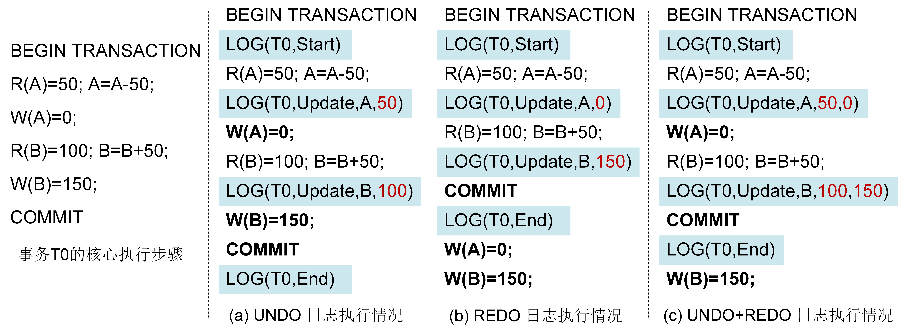
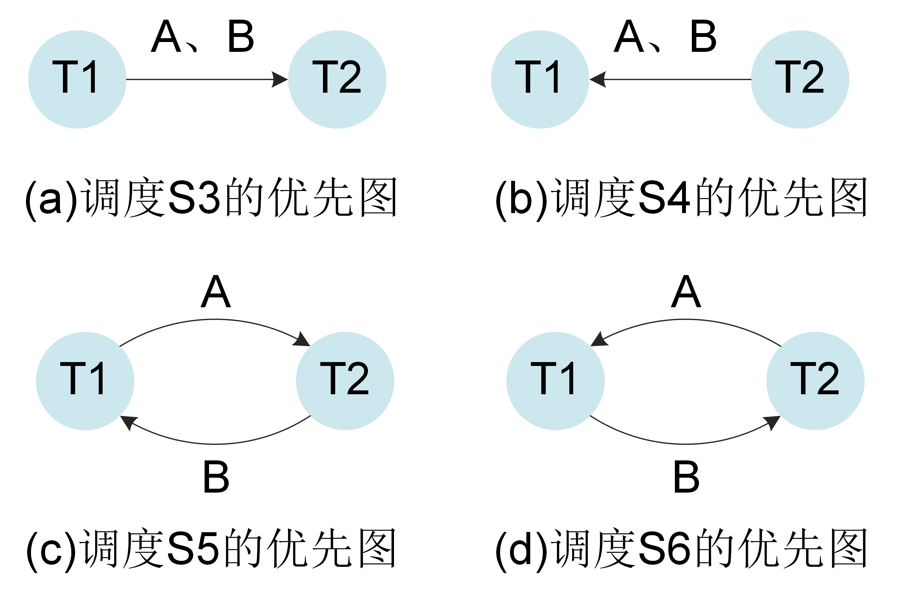
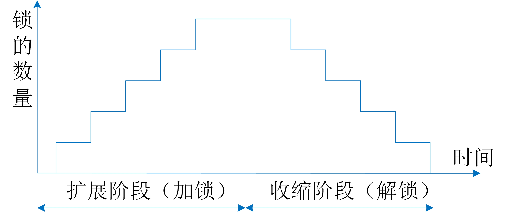

# 事务的处理机制

事务处理主要保证事务的ACID属性，即保证事务执行时的数据正确性。数据库日志恢复机制和并发控制机制是事务处理的重要组成部分。本小节主要介绍这两种机制的相关概念和技术。


## 日志恢复

在数据库管理系统运行过程中，硬件的故障、软件的错误、操作员的失误以及恶意的破坏是不可避免的。这些故障要么使执行中的事务中断，影响数据库的正确性，要么破坏数据库，使数据库中全部或部分数据丢失。恢复技术则是在发生各种故障时能够使数据库从错误状态恢复到一个正确（一致性）的状态。

数据库系统可能发生的故障分为三类：

* 事务内部故障：造成事务不能不被中断的一些故障，如运算溢出、并发事务发生死锁或违反某些完整性约束。
* 系统故障：造成系统停止运转，必须重启的任何故障，如CPU故障、内存损坏、操作系统故障、DBMS代码错误、系统断电等。
* 介质故障：造成外存损坏的各类故障，如磁盘损坏、磁头碰撞、火灾、地震等。这类故障发生的概率小很多，但破坏性却最大。通常，采用数据库备份的方式来解决。

本书主要介绍发生系统故障时的日志恢复技术。首先通过一个简单的例子来了解系统故障时的事务状态。下面给出了例8.1事务T0在数据库管理系统中的核心执行步骤。

``` bson
事务T0：从账户U1向账户U2转账50元（初始值：U1的余额A=50，U2的余额B=100），其执行步骤为：
（1）执行BEGIN TRANSACTION语句； 
（2）将账户U1的余额50从磁盘读入内存缓冲区中，记作R(A)=50；
（3）在内存中计算A=A-50，并将结果写回缓冲区；
（4）将计算结果A=0写入磁盘，记作W(A)=0；
（5）将账户U2的余额100从磁盘读入内存缓冲区中，记作R(B)=100；
（6）在内存中计算B=B+50，并将结果写回缓冲区；
（7）将计算结果B=150写入磁盘，记作W(B)=150；
（8）执行COMMIT语句，将事务标记为已提交。
```

第一种情况，当事务执行完第(4)步时发生了系统故障，此时A的新值可能已经写入磁盘，数据库的状态为(A=0，B=100)。这种不正确的数据库状态是因为该事务只执行了部分操作，违反了事务的原子性。这种没有执行COMMIT/ROLLBACK语句的事务称为未提交事务。那么，在重启系统后，恢复机制需要撤销未提交事务事务在A上的操作，使A的值回滚为初始值50，数据库恢复到未执行该事务的状态（A=50,B=100）。这类恢复操作称为事务撤销（UNDO）。

第二种情况，当事务执行完第(8)步时发生了系统故障，此时A的新值可能已写入磁盘，但是B的新增可能仍在内存缓冲区中，数据库的状态为（A=0,B=100）。这种不正确的数据库状态是因为事务的全部更新结果没有写回磁盘（未持久化），违反了事务的持久性。这种已经执行COMMIT/ROLLBACK语句的事务称为已提交事务。那么，在重启系统后，恢复机制要将已提交事务的所有更新结果重新写回数据库，使数据库恢复到已执行该事务的状态（A=0，B=150）。这类回复操作称为事务重做（REDO）。

所以，当发生系统故障时，数据库管理系统中同时存在未提交事务和已提交事务，这两类事务都可能处于不正确的状态。为了保证正确性，当系统重启后，恢复机制需要**撤销未提交事务，重做已提交事务**。

恢复机制的基本原理是利用存储在数据库管理系统中的冗余数据来实现事务的撤销和重做。建立冗余数据常用的技术有日志文件（Logging）。日志文件是指记录事务对数据库的更新操作的文件。每个事务的开始语句（BEGIN TRANSACTION）、结束语句（COMMIT或ROLLBACK）以及每个更新操作（UPDATE或INSERT或DELETE）均作为日志文件的一条日志记录（Log Record）存储在磁盘中。每条日志记录的内容主要包括：

* 事务标识（标明日志记录是属于哪个事务的）；
* 操作的类型（事务开始、事务结束、插入、删除或修改）；
* 操作对象（记录操作的数据对象，对于事务开始和事务结束类型，此项为空）；
* 更新前数据的旧值（对于插入操作，此项为空）；
* 更新后数据的新值（对于删除操作，此项为空）。

为了保证数据库能够基于日志文件进行恢复，日志恢复技术必须遵循“先写日志文件”（Write Ahead Logging）协议。该协议包括以下三条原则：

* 日志文件中，日志记录的次序必须严格按并发事务执行的时间次序；
* 对每一个更新操作，必须是记录该更新操作的日志记录先写入日志文件，对数据的修改后写入数据库，即日志记录先于数据的修改落盘；
*  只有当事务的所有日志记录都写入日志文件后，该事务被标记为已提交。

规则二保证了UNDO操作，规则三保证了REDO操作。在数据库管理系统中，更新操作的日志记录写入日志文件和对数据的修改写入数据库是两个不同的操作。系统故障可能发生在两个操作之间。如果先写入修改的数据，发生故障时日志文件中没有该操作的日志记录，那么则无法对该操作进行撤销。如果先写入日志记录，发生故障时没有写入修改的数据，那么恢复时只不过是基于日志记录执行了一次不必要的UNDO操作，并不会影响数据库的正确性。因此，一定要先写日志记录后写数据的修改。规则三是说事务提交之前，事务对数据库的所有数据修改可以不用写入磁盘，但是事务的所有日志记录（包括事务开始，事务结束和事务操作）必须写入磁盘。只有这样，当发生系统故障后，才能基于日志记录对已提交事务执行REDO操作。

先写日志文件协议不仅保证了数据库的正确性，而且提高了数据库的事务处理性能。事务提交只强制要求日志记录落盘而不要求数据修改落盘。日志记录写入日志文件是顺序写操作，而数据修改写入数据库是随机写操作。磁盘的顺序写性能远远高于磁盘的随机写性能。

<center>
	
	<br>
	<div display: inline-block; padding : 2px>
		图 8.1 三种日志的执行情况
	</div>
</center>

根据日志记录内容和恢复策略的不同，日志恢复技术分为UNDO日志，REDO日志和UNDO+REDO日志。

（1） UNDO日志

UNDO日志的日志记录中不记录更新后数据的新值（After Image），用于撤销未提交事务已执行的更新操作。图8.1(a)展示了结合UNDO日志技术的例8.1事务的执行步骤：

```bson
 结合UNDO日志技术，事务T0的执行步骤（初始值：U1的余额A=50，U2的余额B=100）：
（1）执行BEGIN TRANSACTION语句;  
（2）向日志文件中写入事务T0的开始日志记录，记作Log(T0,Start)；
（3）将账户U1的余额50从磁盘读入内存缓冲区中，记作R(A)=50；
（4）在内存中计算A=A-50，并将结果写回缓冲区；
（5）向日志文件中写入事务T0对A的更新操作记录， 记作Log(T0,Update,A,50)；
（6）将计算结果A=0写入磁盘， 记作W(A)=0；
（7）将账户U2的余额100从磁盘读入内存缓冲区中，记作R(B)=100；
（8）在内存中计算B=B+50$并将结果写回缓冲区；
（9）向日志文件中写入事务T0对B的更新操作记录， 记作Log(T0,Update,B,100)；
（10）将计算结果B=150写入磁盘， 记作W(B)=150；
（11）执行COMMIT语句；
（12）向日志文件中写入事务T0的结束日志记录，记作Log(T0,End)，然后将事务标记为已提交；
```
从上述步骤可以看出，事务一旦执行就先写入一条事务开始的日志记录；当执行更新操作时，首先写入更新操作的日志记录，然后再写数据的修改。每条操作日志记录中记录了事务标识符、操作类型、更新对象以及更新前数据的旧值（Befor Image）；最后在执行COMMIT语句后，写入一条事务结束的日志记录，只有当结束日志记录写入日志文件后，事务才算已提交。

系统故障的恢复是由系统在重新启动时自动完成的。基于UNDO日志，系统恢复的步骤是：

* 查找未提交事务：从头扫描日志文件（正向扫描日志文件），找出系统故障发生时所有未提交的事务，这些事务只有事务开始日志记录，没有事务结束日志记录，然后将事务标识记入撤销队列（UNDO-LIST）中；
* 撤销事务：从尾扫描日志文件（反向扫描日志文件），对撤销队列中每个事务的更新操作执行逆操作，即将未提交事务的日志记录中“更新前数据的旧值（Before Image）”写入数据库。

值得注意的是，UNDO日志恢复技术要求在事务提交之前事务的所有数据修改必须已写入磁盘，也就是说，写Log(T0,End)日志记录之前A和B的更新结果已写入数据库。那么，当系统故障发生在步骤(12)后，已提交事务T0已经持久化，并且数据库状态是正确的。所以，UNDO日志恢复技术不需要考虑已提交事务的恢复。

（2）REDO日志

REDO日志的日志记录中不记录更新前数据的旧值，用于重做已提交事务的更新操作。图8.1(b)展示了例8.1在REDO日志恢复技术下的执行步骤。

```bson
 结合REDO日志技术，事务T0的执行步骤（初始值：U1的余额A=50，U2的余额B=100）：
（1）执行BEGIN TRANSACTION语句;  
（2）向日志文件中写入事务T0的开始日志记录，记作Log(T0,Start)；
（3）将账户U1的余额50从磁盘读入内存缓冲区中，记作R(A)=50；
（4）在内存中计算A=A-50，并将结果写回缓冲区；
（5）向日志文件中写入事务T0对A的更新操作记录， 记作Log(T0,Update,A,0)；
（6）将账户U2的余额100从磁盘读入内存缓冲区中，记作R(B)=100；
（7）在内存中计算B=B+50$并将结果写回缓冲区；
（8）向日志文件中写入事务T0对B的更新操作记录， 记作Log(T0,Update,B,150)；
（9）执行COMMIT语句；
（10）向日志文件中写入事务T1的结束日志记录，记作Log(T0,End)，然后将事务标记为已提交；
（11）将计算结果A=0写入磁盘， 记作W(A)=0；
（12）将计算结果B=150写入磁盘， 记作W(B)=150；
```
基于REDO日志，系统的恢复步骤是：

* 查找已提交事务：正向扫描日志文件，找出系统故障发生时所有已提交的事务，这些事务既包含事务开始日志记录，也包含事务结束日志记录，然后将事务标识记入重做队列（REDO-LIST）中；
* 重做事务：正向扫描日志文件，对重做队列中每个事务的更新操作进行重做，即将已提交事务的日志记录中“更新后数据的新值（After Image）”写入数据库。

与UNDO日志恢复技术不同，REDO日志恢复技术要求在事务提交之后所有数据修改才能写入磁盘，也就是，在写入Log(T0,End)日志记录之后A和B的更新结果才写入数据库。那么，当系统故障发生在步骤(10)之前，未提交事务T0具备原子性，即事务T1的操作全部未发生，数据库状态是正确的。所以，REDO日志恢复技术不需要考虑未提交事务的恢复。

（3）UNDO+REDO日志

UNDO+REDO日志的日志记录中既记录更新前数据的旧值也记录更新后数据的新值，用于撤销未提交事务已执行的更新操作和重做已提交事务的更新操作。图8.1(c)展示了例8.1在UNDO+REDO日志恢复技术下的执行步骤。

```bson
 结合UNDO+REDO日志技术，事务T0的执行步骤（初始值：U1的余额A=50，U2的余额B=100）：
（1）执行BEGIN TRANSACTION语句;  
（2）向日志文件中写入事务T0的开始日志记录，记作Log(T0,Start)；
（3）将账户U1的余额50从磁盘读入内存缓冲区中，记作R(A)=50；
（4）在内存中计算A=A-50，并将结果写回缓冲区；
（5）向日志文件中写入事务T0对A的更新操作记录， 记作Log(T0,Update,A,50,0)；
（6）将计算结果A=0写入磁盘， 记作W(A)=0；
（7）将账户U2的余额100从磁盘读入内存缓冲区中，记作R(B)=100；
（8）在内存中计算B=B+50$并将结果写回缓冲区；
（9）向日志文件中写入事务T0对B的更新操作记录， 记作Log(T0,Update,B,100,150)；
（10）执行COMMIT语句；
（11）向日志文件中写入事务T0的结束日志记录，记作Log(T0,End)，然后将事务标记为已提交；
（12）将计算结果B=150写入磁盘， 记作W(B)=150；
```
基于UNDO+REDO日志，系统的恢复步骤是：

* 查找已提交事务和未提交事务：正向扫描日志文件，找出系统故障发生时所有已提交的事务，将事务标识记入重做队列（REDO-LIST）；同时找出所有未提交事务，将事务标识记入撤销队列（UNDO-LIST）中；
* 撤销事务：反向扫描日志文件，对撤销队列中每个事务的更新操作执行逆操作；
* 重做事务：正向扫描日志文件，对重做队列中每个事务的更新操作进行重做。

与UNDO日志和REDO日志技术相比，UNDO+REDO日志恢复技术没有强制要求所有的数据修改必须在事务提交之后还是之前写入数据库。只要日志技术遵循“先写日志文件协议”，数据库就能在发生系统故障后恢复到一个正确的状态。目前，大多数关系数据库管理系统采用的是UNDO+REDO日志恢复技术。在UNDO日志技术中，事务提交之前所有数据修改的落盘操作会降低事务处理性能；在REDO日志技术中，事务提交之前所有数据修改都存在内存缓冲区中，对内存的消耗比较大。


## 并发控制

数据库是一个共享资源，可以供多个用户同时使用。像12306购票系统，电商购物系统等同一时刻并发运行的事务数可高达数百上千个，这就很容易产生多个事务同时更新同一数据对象的情况。如果不对这些事务的并发操作加以控制可能会破坏事务的隔离性，造成数据库的不一致性。并发控制机制就是正确地调度事务之间的并发操作，使得一个事务的执行不受其他事务的干扰。

（1） 可串行化调度

怎样的事务调度才算正确的呢？显然，事务一个一个地串行执行，即每个时刻只有一个事务运行，其他事务必须等到这个事务结束之后才能运行，这种串行调度是正确的。但是，串行调度并没有让事务并行运行，并且浪费了大量的系统资源，如CPU资源等。为了提高系统的效率同时保证数据库的正确性，并发控制机制需让事务之间的操作尽可能的并行执行，同时事务调度的执行结果要等价于串行调度的执行结果。这种调度称为可串行化调度。


**定义：多个事务的并行执行是正确的，当且仅当其执行结果与这些事务按某一次序串行执行的结果相同，称这种调度为可串行化调度。**

可串行性（Serializability）是并发事务正确调度的准则，也就是说，一个给定的并发事务调度，当且仅当它是可串行化的，才认为是正确调度。这是判断正确调度的充分必要条件。

> [例8.2] 现有两个事务，分别包含下列操作（初始值A=25，B=25）：<br>
> &nbsp;&nbsp;&nbsp;&nbsp;事务T1： 读A；A=A+100；写回A；读B；B=B+100；写回B； <br>
> &nbsp;&nbsp;&nbsp;&nbsp;事务T2：读A；A=A$\times$2；写回A；读B；B=B$\times$2；写回B。<br>
> 两个事务的6种调度策略： <br>
> &nbsp;&nbsp;&nbsp;&nbsp;S1=r1(A)w1(A)r1(B)w1(B)r2(A)w2(A)r2(B)w2(B)&nbsp;&nbsp;&nbsp;&nbsp;串行调度<br>
> &nbsp;&nbsp;&nbsp;&nbsp;S2=r2(A)w2(A)r2(B)w2(B)r1(A)w1(A)r1(B)w1(B)&nbsp;&nbsp;&nbsp;&nbsp;串行调度<br>
> &nbsp;&nbsp;&nbsp;&nbsp;S3=r1(A)w1(A)r2(A)w2(A)r1(B)w1(B)r2(B)w2(B)&nbsp;&nbsp;&nbsp;&nbsp;可串行化调度<br>
> &nbsp;&nbsp;&nbsp;&nbsp;S4=r2(A)w2(A)r1(A)w1(A)r2(B)w2(B)r1(B)w1(B)&nbsp;&nbsp;&nbsp;&nbsp;可串行化调度<br>
> &nbsp;&nbsp;&nbsp;&nbsp;S5=r1(A)w1(A)r2(A)w2(A)r2(B)w2(B)r1(B)w1(B)&nbsp;&nbsp;&nbsp;&nbsp;不可串行化调度<br>
> &nbsp;&nbsp;&nbsp;&nbsp;S6=r2(A)w2(A)r1(A)w1(A)r1(B)w1(B)r2(B)w2(B)&nbsp;&nbsp;&nbsp;&nbsp;不可串行化调度<br>

假设A、B的初始值均为25。按T1$\rightarrow$T2次序的执行结果为A=250，B=250；按T2$\rightarrow$T1次序的执行结果为A=150，B=150。图8.2给出了对这两个事务不同的6种调度策略和执行结果。其中，图8.2(a)的调度S1和图8.2(b)的调度S2为两种不同的串行调度；图8.2(c)的调度S3的执行结果与S1的执行结果相同，图8.2(d)的调度S4的执行结果与S2的执行结果相同，所以S3和S4是正确的调度；图8.2(e)的调度S5和图8.2(f)的调度S6的执行结果与S1、S2的结果都不同，所以是错误的调度。

<center>
	
	<br>
	<div display: inline-block; padding : 2px>
		图 8.2 并发事务的执行调度策略
	</div>
</center>

（2） 冲突可串行化

例8.2是通过执行结果来判断一个调度是否是可串行化调度，那么有没有其他方法来判断呢？这里给出判断可串行化调度的一个充分条件，即如果一个调度是冲突可串行化的，那么该调度一定是可串行化的。**注意，冲突可串行化调度是可串行化调度的充分条件，而不是必要条件。**

在介绍冲突可串行化调度的定义之前，先来认识冲突操作的概念。**所谓的冲突操作是指不同的事务对同一个数据的读写操作和写写操作，$R_i(x)$与$W_j(x)$，$W_i(x)$与$W_j(x)$，其中$i\neq j$**。其他操作是不冲突操作。冲突操作需要同时满足两个条件：（1）操作涉及同一个数据对象；（2）操作中至少有一个是写操作。

不同事务的冲突操作次序是不能交换的。对于$R_i(x)$与$W_j(x)$，如果改变两个操作的次序，那么事务$T_i$读到的$x$值发生了改变，自然也会影响该事务后续的操作。对于$W_i(x)$与$W_j(x)$，改变两个操作的次序也会影响数据库的状态，$x$变成了$T_i$更新后的值。同样地，同一事务对同一个数据的读写操作和写写操作次序也是不能交换的。

**定义：一个调度S在保证冲突操作的次序不变的情况下，通过交换两个事务不冲突操作的次序得到另一个调度S'，如果S’是串行的，那么S就是冲突可串行化调度。**

例8.2中调度S3=r1(A)w1(A)**r2(A)w2(A)r1(B)w1(B)**r2(B)w2(B)，先将w2(A)与r1(B)w1(B)两个不冲突操作的次序进行交换，得到S3'=r1(A)w1(A)r2(A)r1(B)w1(B)w2(A)r2(B)w2(B)；然后再交换r2(A)与r1(B)w1(B)两个不冲突操作的次序，得到S3''=r1(A)w1(A)r1(B)w1(B)r2(A)w2(A)r2(B)w2(B)。S3''等于串行调度S1，所以S3是冲突可串行化调度，当然S3也是可串行化调度。同样地，调度S4也可以通过交换不冲突操作的次序得到串行调度S2，所以S4也是冲突可串行化调度。

例8.2中调度S5=r1(A)**w1(A)r2(A)w2(A)**r2(B)**w2(B)r1(B)w1(B)**, 其中，w1(A)与r2(A)w2(A)是冲突操作，并且w2(B)与r1(B)w1(B)也是冲突操作，它们之间的次序不能交换，因此无法转换成S1或S2的调度。同样地，调度S6也无法转换成S1或S2的调度。所以，S5和S6都不是冲突可串行化调度，当然也就不是可串行化调度。

另外，还可以通过优先图（Precedence Graph）来判断一个调度是否为冲突可串行化调度。优先图是一个有向图，图中的顶点表示事务，顶点之间的有向边表示事务之间有冲突操作，并且有向边起始顶点对应的事务先执行操作，有向边末尾顶点对应的事务后执行操作。如果某个调度生成的优先图是一个有向无环图，则该调度是冲突可串行化调度。

<center>
	
	<br>
	<div display: inline-block; padding : 2px>
		图 8.3 事务调度的优先图
	</div>
</center>

图8.3中给出了例8.2中调度S3、S4、S5和S6的优先图。其中，S3的调度中包含了T1和T2两个事务，两个事务在数据A、数据B上存在冲突操作w1(A)与r2(A)，w1(B)与r2(B)，并且在两组冲突操作中都是T1先执行T2后执行，因此，S3调度生成的优先图中有T1和T2两个顶点，以及一条由T1指向T2的边。如图8.3(a)所示，该优先图中不存在环，所以S3调度是冲突可串行化调度。同样地，图8.3(b)中S4调度的优先图中也不存在环。但是，对于S5调度来说，T1和T2事务在数据A、数据B上存在冲突操作w1(A)与r2(A)，w2(B)与r1(B)，在数据A上的冲突操作中T1先执行T2后执行，但是在数据B上的冲突操作中T2先执行T1后执行，所以，S5调度生成的优先图中有一条由T1指向T2的边以及一条由T2指向T1的边。如图8.3(c)所示，该优先图中存在环，因此S5调度不是冲突可串行化调度。同样地，图8.3(d)中S6调度的优先图中也存在环。

（3）两阶段封锁

为了保证并发事务执行的正确性，数据库管理系统的并发控制机制必须提供一定的技术来保证事务调度是冲突可串行化的。并发控制机制的主要技术有封锁（Locking）、时间戳（Timestamp）、乐观并发控制（Optimistic Concurrency Control, OCC）和多版本并发控制（Multi-version Concurrency Control, MVCC）等。这里主要介绍数据库管理系统普遍采用的两阶段封锁（Two-phase Locking, 2PL）协议来实现事务调度的冲突可串行化。

封锁是实现并发控制的一个非常重要的技术，它指事务T在对某个数据操作之前，先对其进行加锁。加锁后事务T对该数据具有一定的控制权，在事务T释放它的锁之前，其他事务不能更新此数据。锁的类型有两种：排它锁（简称X锁）和共享锁（简称S锁）。

* 排它锁又称写锁。如果事务T对数据A加X锁，则只允许T读取和修改A，其他任何事务不能对A加任何类型的锁，直到T释放A上的锁为止。也就是其他事务只能在T释放A上的X锁之后才能读取和修改A。
* 共享锁又称读锁。如果事务T对数据A加S锁，则事务T可以读A但不能修改A，其他事务只能对A加S锁，而不能加X锁，直到T释放A上的S锁为止。也就是其他事务可以读A，但是只能在T释放A上的S锁之后才能修改A。

<center>
	
	<br>
	<div display: inline-block; padding : 2px>
		图 8.4 两阶段封锁协议
	</div>
</center>

两阶段封锁协议是指所有事务分为加锁和解锁两个阶段，如图8.4所示。

* 加锁阶段也称为扩展阶段。在这个阶段，事务在对任何数据进行读、写操作之前，先获得该数据上的读锁、写锁，且不能释放任何锁。
* 解锁阶段也称为收缩阶段。在这个阶段，事务释放所有数据上的所有锁，且不能再对任何数据进行加锁。

如果事务T遵守两阶段封锁协议，其封锁序列为：
`Slock(A) Slock(B) Xlock(C) Unlock(B) Unlock(A) Unlock(C)`
其中Slock(A)表示在数据A上加读锁，Xlock(C)表示在数据C上加写锁，Unlock(B)表示释放数据B上的所有锁。如果事务T不遵守两阶段封锁协议，其封锁序列为：
`Slock(A) Unlock(A) Slock(B) Xlock(C) Unlock(B)  Unlock(C)`。

如果并发执行的所有事务均遵循两阶段封锁，则这些事务的任何并发调度都是可串行化的。但如果并发执行的所有事务部遵循两阶段封锁，则它们的并发调度是不可串行化的。

<center>
	
	<br>
	<div display: inline-block; padding : 2px>
		图 8.5 并发事务的封锁与调度情况
	</div>
</center>

图8.5给出了例8.2两个事务的封锁和调度情况。在图8.5(a)中，事务T1和T2没有遵循两阶段封锁。当数据库管理系统同时接收到多个事务处理请求时，会为每个事务分配一个工作线程进行处理。假设，事务T1所在的线程优先获得数据A上的读锁和写锁，那么T2只能等待。当T1对数据A进行读取和修改之后立即释放了数据A上的所有锁，此时，假设事务T2所在的线程立即获得了数据A和数据B上的所有锁并执行完所有的操作。在此期间，T1只能等待T2释放数据B上的所有锁之后才能执行剩余的操作。这种封锁方式产生的事务调度是图8.2(e)中的S5=r1(A)w1(A)r2(A)w2(A)r2(B)w2(B)r1(B)w1(B)，它是不可串行化的。

在图8.5(b)和图8.5(c)中，事务T1和T2都遵循两阶段封锁，它们的事务调度是可串行化的。在图8.5(b)中，事务T1先获得数据A和数据B上的读锁和写锁，事务T2只能等待直到T1执行完所有的操作并释放所有锁之后。这种封锁方式产生的事务调度是图8.2(a)中的S1=r1(A)w1(A)r1(B)w1(B)r2(A)w2(A)r2(B)w2(B），相当于事务T1和事务T2串行执行。在图8.5(c)中，事务T1分别先获得数据A和数据B上的读锁和写锁，事务T2只能等待。当T1释放在数据A上的所有锁之后，T2获得数据A上的读锁和写锁，对数据A进行读取和修改；当T1释放在数据B上的所有锁之后，T2才能获得数据B上的读锁和写锁，然后对数据B进行读取和修改。这种封锁方式产生的事务调度是图8.2(c)中的S3=r1(A)w1(A)r2(A)w2(A)r1(B)w1(B)r2(B)w2(B)，等价于事务T1和事务T2串行执行，但不同的是T1对数据B的读取和修改操作与T2对数据A的读取和修改操作是并行的。

需要说明的是，事务遵守两阶段封锁协议是可串行化调度的充分条件，而不是必要条件。也就是说，如并发事务都遵守两阶段封锁协议，则这些事务的调度是可串行化的；但是，如果并发事务的一个调度是可串行化的，不一定所有事务都符合两阶段封锁协议。


